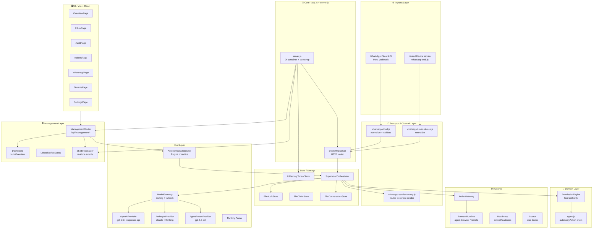
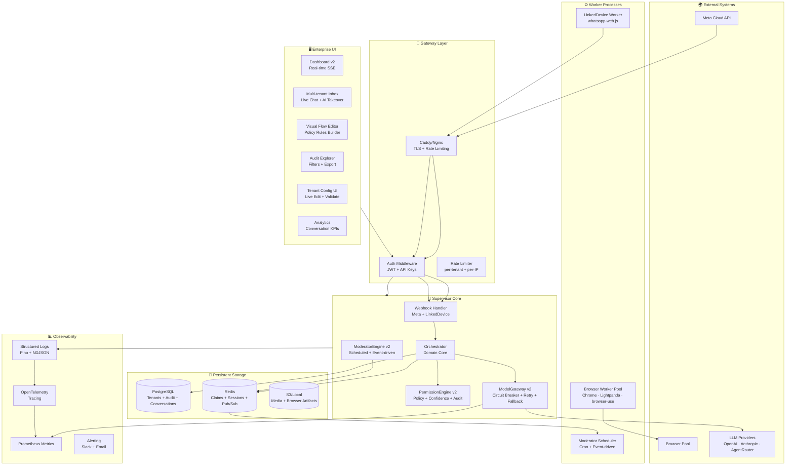

# WhatsApp AI Supervisor — Enterprise-Grade Maturity Plan

> **هدف:** تحويل المشروع من نموذج أولي وظيفي إلى منصة enterprise-grade كاملة
> تغطي: UI/UX • Backend • Engines • Events • Tools • Interfaces • Security • Observability • Testing

---

## 📊 Code Graph — فهم الكود الحالي

---

## 🔍 Code Review — نقاط الضعف الحالية

### 🔴 Blockers (يجب حلها)

| # | المشكلة | الملف | التأثير |
|---|---------|-------|---------|
| B1 | `InMemoryTenantStore` — يضيع عند إعادة التشغيل، يمنع horizontal scaling | `core/tenant-store.js` | data loss, single-instance only |
| B2 | `FileAuditStore` / `FileClaimStore` — ملفات مشتركة بدون locking = race condition عند concurrent requests | `core/file-audit-store.js` | data corruption |
| B3 | `FileConversationStore.list()` يقرأ **كل** events من disk في كل request = O(n) مع نمو البيانات | `core/file-conversation-store.js` | performance cliff |
| B4 | لا يوجد rate limiting على أي endpoint — `/v1/simulate` مفتوح بدون auth | `app.js` | abuse / DoS |
| B5 | Management token يمر عبر query param `?token=` في GET requests — يظهر في server logs | `management/router.js:28` | credential leak |
| B6 | لا يوجد input sanitization أو schema validation على `tenants.json` | `config.js` | config injection |
| B7 | No structured logging — `console.log` فقط | server-wide | unobservable production |

### 🟡 Suggestions (يجب تحسينها)

| # | المشكلة | التأثير |
|---|---------|---------|
| S1 | Orchestrator instances مكاش (Map) لكن model providers لا تُعاد إنشاؤها عند تغيير tenant config | stale config |
| S2 | لا يوجد circuit breaker على model providers — إذا فشل OpenAI ينتظر timeout الكامل | latency spikes |
| S3 | `moderator-engine.js` يستدعي `orchestrator.modelGateway.decide()` مباشرة — يتخطى `PermissionEngine` | policy bypass |
| S4 | UI بسيطة جداً — لا تدعم multi-tenant switching بشكل كامل في `InboxPage` | UX gap |
| S5 | لا يوجد webhook signature rotation أو key management | security debt |
| S6 | Browser runtime لا يعزل sessions per-tenant | tenant data leak |
| S7 | لا يوجد observability: no metrics, no traces, no structured logs | unobservable |

### 💭 Nits

- `package.json` يستخدم `npm` بدلاً من `bun` (required per user rules)
- لا يوجد ESLint / TypeScript في الـ backend (frontend فقط)
- Test files في `/tests/` بدون تقسيم unit/integration/e2e

---

## 🏗️ Architecture Vision — Enterprise-Grade Target

---

## 📋 الخطة — 9 Milestones

---

### Milestone 1 — Foundation Hardening (الأساس الصلب)
**هدف:** إزالة الـ blockers الحرجة قبل أي feature جديدة

#### Phase 1.1 — Package Manager Migration (Bun)
- **[MODIFY]** `package.json` — تحويل scripts لـ `bun` بدلاً من `node` و `npm`
- **[NEW]** `bun.lockb` — lockfile
- تحديث `Dockerfile` لاستخدام `oven/bun` base image
- تحديث `compose.yaml` لكل services

#### Phase 1.2 — Structured Logging (Pino)
- **[NEW]** `src/infra/logger.js` — Pino structured logger, configurable level
- تغيير جميع `console.log/error/warn` في كل ملفات الـ backend لـ `logger.*`
- Log correlation ID لكل HTTP request
- **UAT:** `curl /health` → JSON log يظهر في stdout مع `requestId` field

#### Phase 1.3 — Schema Validation
- **[NEW]** `src/config/schema.js` — Zod schema لـ `tenants.json` + env vars
- تشغيل validation عند startup، abort مع message واضحة
- **[MODIFY]** `src/runtime/doctor.js` — إضافة schema validation check
- **UAT:** tenant بدون `id` → رسالة خطأ واضحة + exit 1

#### Phase 1.4 — Security Fixes
- **[MODIFY]** `src/management/router.js` — حذف query param auth لـ GET requests
- **[NEW]** `src/infra/rate-limiter.js` — in-memory rate limiter per IP (sliding window)
- تطبيق rate limit على `/v1/simulate`, `/webhooks/whatsapp`, كل management endpoints
- إضافة `MANAGEMENT_TOKEN` required check عند startup (warn if missing)
- **UAT:** 100 requests في ثانية → 429 response

#### Phase 1.5 — Testing Foundation
- تحويل tests لـ `bun test` بدلاً من `node --test`
- تقسيم tests: `tests/unit/`, `tests/integration/`, `tests/e2e/`
- **[NEW]** `tests/fixtures/` — shared test data factory
- إضافة test coverage threshold ≥ 80%
- **[NEW]** GitHub Actions CI يشغل `bun test --coverage`

---

### Milestone 2 — Persistent Storage Layer
**هدف:** استبدال file-based stores بـ PostgreSQL + Redis

#### Phase 2.1 — Database Schema
- **[NEW]** `src/infra/db/schema.sql` — PostgreSQL schema:
  - `tenants` table (مع JSONB للـ config)
  - `conversations` table + `conversation_events` table (partitioned by tenant_id)
  - `audit_events` table (hypertable إذا TimescaleDB)
  - `claims` table (مع TTL + unique constraint)
- **[NEW]** `src/infra/db/migrations/` — Flyway/dbmate migrations
- **UAT:** `bun run db:migrate` → schema يُطبق cleanly على fresh PG

#### Phase 2.2 — PostgreSQL Adapters
- **[NEW]** `src/infra/pg-tenant-store.js` — implements `TenantStore` interface
- **[NEW]** `src/infra/pg-audit-store.js` — implements `AuditStore` interface
- **[NEW]** `src/infra/pg-conversation-store.js` — implements `ConversationStore` interface (cursor pagination, بدلاً من load-all)
- **[NEW]** `src/infra/pg-claim-store.js` — atomic claim بـ `INSERT ... ON CONFLICT DO NOTHING`
- **[MODIFY]** `src/domain/` — تعريف abstract interfaces (TS-style JSDoc types)

#### Phase 2.3 — Redis Layer
- **[NEW]** `src/infra/redis-client.js` — Redis connection singleton
- **[NEW]** `src/infra/redis-claim-store.js` — Redis-backed claim (SET NX EX)
- **[NEW]** `src/infra/redis-pub-sub.js` — pub/sub للـ SSE events (replaces in-process SSEBroadcaster)
- هذا يفتح الباب لـ horizontal scaling

#### Phase 2.4 — Storage Strategy Toggle
- **[MODIFY]** `src/server.js` — `STORAGE_BACKEND=file|postgres` env toggle
- File backend يبقى للـ local dev, PG للـ production
- **UAT:** integration tests تشتغل على الاثنين

---

### Milestone 3 — AI Engine Upgrades
**هدف:** circuit breakers، model routing متقدم، security

#### Phase 3.1 — Circuit Breaker on ModelGateway
- **[MODIFY]** `src/ai/model-gateway.js` — إضافة circuit breaker state per provider:
  - States: CLOSED → OPEN → HALF-OPEN
  - Threshold: 3 failures في 30 ثانية → OPEN
  - Auto-recovery: HALF-OPEN بعد 60 ثانية
- **[NEW]** `src/ai/circuit-breaker.js` — standalone class
- Metrics: `model_provider_failures_total`, `model_provider_latency_histogram`
- **UAT:** mock provider يفشل 3 مرات → circuit يُفتح → fallback provider يُستخدم

#### Phase 3.2 — ModelGateway v2 (Advanced Routing)
- **[MODIFY]** `src/ai/model-gateway.js`:
  - دعم `temperature` per route
  - دعم `maxTokens` per model
  - Dynamic routing بناءً على intent المتوقع (cheap model للـ classification، expensive للـ reply)
  - Semantic fallback: إذا فشل primary route → يجرب secondary
- **[NEW]** `src/ai/gemini-provider.js` — Google Gemini 2.5 Pro provider
- **UAT:** route بـ 2 providers → الأول يفشل → الثاني ينجح → log يُظهر fallback

#### Phase 3.3 — PermissionEngine v2
- **[MODIFY]** `src/domain/permission-engine.js`:
  - دعم **time-based rules** (e.g., لا يرد بعد الساعة 10pm)
  - دعم **customer-tier rules** (VIP → أقل قيود)
  - دعم **topic blacklisting** (أي رسالة تحتوي كلمات معينة → escalate فوراً)
  - دعم **rate-limiting per customer** (لا أكثر من X ردود في ساعة)
- **[NEW]** `tests/unit/permission-engine-v2.test.js`

#### Phase 3.4 — ModeratorEngine v2 (Event-Driven)
- **[MODIFY]** `src/ai/moderator-engine.js`:
  - Fix **policy bypass bug** — المديتور يمر عبر `orchestrator.handle()` كاملاً (مش `modelGateway.decide()` مباشرة)
  - إضافة stale-thread detection بـ configurable TTL
  - إضافة proactive follow-up scheduling قابل للتخصيص per-tenant
- **[NEW]** `src/ai/moderator-scheduler.js` — cron-based + event-triggered scheduler
- **UAT:** thread بدون رد لـ 2 ساعات → moderator يُرسل follow-up تلقائياً

#### Phase 3.5 — Multi-Provider Thinking Models
- **[MODIFY]** `src/ai/anthropic-provider.js` — دعم extended thinking budget
- **[MODIFY]** `src/ai/agentrouter-provider.js` — دعم o3-mini reasoning traces
- **[NEW]** `src/ai/thinking-sanitizer.js` — removes internal `<think>` blocks من الرد النهائي
- **UAT:** رسالة معقدة → thinking يظهر في audit، الرد النهائي بدون thinking tags

---

### Milestone 4 — Multi-Modal & Media Support
**هدف:** دعم الصور والصوت والملفات بجانب النص

#### Phase 4.1 — Media Normalization
- **[MODIFY]** `src/channels/whatsapp-cloud.js` — تطبيع رسائل image/audio/video/document
- **[MODIFY]** `src/channels/whatsapp-linked-device.js` — نفس الشيء
- **[NEW]** `src/media/media-store.js` — تخزين media locally أو S3
- **[NEW]** `src/media/media-downloader.js` — تحميل media من Meta API بـ auth

#### Phase 4.2 — Vision Provider Support
- **[MODIFY]** `src/ai/openai-provider.js` — دعم image inputs (base64 + URL)
- **[MODIFY]** `src/ai/anthropic-provider.js` — دعم vision
- **[MODIFY]** `src/core/orchestrator.js` — تمرير media context للـ model
- **UAT:** عميل يرسل صورة → AI يصف الصورة ويرد

#### Phase 4.3 — Audio Transcription
- **[NEW]** `src/media/transcription-service.js` — Whisper API / Gemini Audio
- **[MODIFY]** `src/core/orchestrator.js` — transcribe audio قبل إرساله للـ model
- **UAT:** عميل يرسل voice note → يُحول لنص → AI يرد

---

### Milestone 5 — Enterprise UI/UX
**هدف:** لوحة تحكم enterprise-grade كاملة

#### Phase 5.1 — Design System
- **[NEW]** `ui/src/styles/tokens.css` — CSS custom properties: colors, spacing, radius, shadows
- **[NEW]** `ui/src/styles/theme.css` — light/dark themes
- Google Fonts: Inter (UI) + JetBrains Mono (code)
- **[MODIFY]** `ui/src/components/` — إعادة بناء Shell, Metric, Status بـ design system

#### Phase 5.2 — Real-time Inbox (Complete Rebuild)
- **[MODIFY]** `ui/src/pages/InboxPage.tsx`:
  - Multi-tenant switcher في الـ sidebar
  - Conversation list مع live updates via SSE
  - Chat view: bubbles (inbound/outbound/AI/human)، thinking traces collapsible
  - AI Takeover toggle مع confirmation dialog
  - Human Reply input مع character counter + send shortcut
  - **Proactive Follow-up** trigger button per thread
  - Conversation search + filter by status
- **UAT:** رسالة تصل → تظهر في inbox في < 1 ثانية بدون refresh

#### Phase 5.3 — Visual Policy Builder
- **[NEW]** `ui/src/pages/PolicyBuilderPage.tsx`:
  - Drag-and-drop rule builder
  - Intent → Action mapping بدون YAML/JSON يدوي
  - Live preview: "What would happen if customer says X?"
  - Rule conflict detection (overlapping intents)
  - Confidence threshold slider per rule
- **[NEW]** `src/management/router.js` — endpoints: `POST /api/management/tenants/:id/policy`

#### Phase 5.4 — Analytics Dashboard
- **[NEW]** `ui/src/pages/AnalyticsPage.tsx`:
  - Conversation volume over time (line chart)
  - Action distribution: reply/human/ignore/act (pie chart)
  - Model provider usage + latency (bar chart)
  - Human takeover rate trend
  - Top intents heatmap
  - Average response confidence histogram
- **[NEW]** `src/management/analytics.js` — computes metrics from audit events

#### Phase 5.5 — Tenant Management UI
- **[MODIFY]** `ui/src/pages/TenantsPage.tsx`:
  - Create/Edit tenant form مع schema validation real-time
  - Per-tenant AI route builder
  - BYOK key management (masked display)
  - Linked device session viewer + QR Code scanner داخل UI
  - WhatsApp status badge (connected/disconnected/pairing)
- **UAT:** تعديل `businessContext.name` من UI → يُحفظ → يُظهر في conversations

#### Phase 5.6 — Audit Explorer
- **[MODIFY]** `ui/src/pages/AuditPage.tsx`:
  - Virtualized list (react-virtual) للـ audit events
  - Filter: by tenant, action, model, date range
  - Export to CSV/JSON
  - Audit event detail panel مع thinking trace
  - Replay simulation من audit event

---

### Milestone 6 — Browser Agent Engine Upgrade
**هدف:** browser worker إنتاجي، متعدد المستأجرين، مع visibility كاملة

#### Phase 6.1 — Tenant-Isolated Browser Sessions
- **[MODIFY]** `src/browser/` — كل tenant له browser profile منفصل
- Session persistence per tenant
- **[NEW]** `src/browser/browser-pool.js` — pool manager مع max concurrency

#### Phase 6.2 — browser-use Integration
- **[NEW]** `src/browser/browser-use-provider.js` — دعم `browser-use` library high-level API
- Actions: navigate, click, fill form, extract data, screenshot
- Sandbox mode: `allowedDomains` enforced at DNS level
- **[NEW]** `src/browser/action-recorder.js` — records browser steps في audit

#### Phase 6.3 — BrowserOS / Lightpanda
- **[MODIFY]** `src/browser/runtime-factory.js` — إضافة `browseros` و `lightpanda` drivers
- Config: `BROWSER_ENGINE=lightpanda|chrome|browseros`
- **UAT:** browser task على `allowedDomains` ينجح، على domain غير مسموح → يُرفض

---

### Milestone 7 — Observability Stack
**هدف:** رؤية كاملة للإنتاج

#### Phase 7.1 — Metrics (Prometheus)
- **[NEW]** `src/infra/metrics.js` — `prom-client` registry:
  - `http_request_duration_seconds` histogram
  - `model_decision_duration_seconds` histogram per provider
  - `conversation_events_total` counter per tenant + action
  - `circuit_breaker_state` gauge per provider
  - `linked_device_sessions` gauge
- **[NEW]** `GET /metrics` endpoint (مع auth اختياري)

#### Phase 7.2 — OpenTelemetry Tracing
- **[NEW]** `src/infra/tracer.js` — OTLP exporter
- Spans على: HTTP request → orchestrator → modelGateway → channelSender
- Context propagation عبر async boundaries
- Export لـ Jaeger / Tempo / Grafana Cloud

#### Phase 7.3 — Health & Readiness v2
- **[MODIFY]** `src/runtime/readiness.js` — checks:
  - DB connectivity
  - Redis connectivity
  - Model provider ping
  - Browser runtime status
  - Linked device session states
- **[NEW]** `GET /startup` — startup probe (K8s compatible)

#### Phase 7.4 — Alerting Rules
- **[NEW]** `deploy/alerts.yml` — Prometheus AlertManager rules:
  - `ModelProviderDown` — circuit open > 5 min
  - `ConversationBacklog` — unanswered inbound > 100
  - `HumanTakeoverSpike` — human rate > 50% في 10 دقائق
  - `LinkedDeviceDisconnected` — session down > 5 min

---

### Milestone 8 — Security Hardening
**هدف:** enterprise-grade security بدون ثغرات

#### Phase 8.1 — Auth Layer
- **[NEW]** `src/infra/auth.js` — JWT-based management auth (RS256)
- Session management: إصدار JWT من `/api/auth/login`, refresh token rotation
- RBAC: roles `admin`, `operator`, `viewer` per tenant
- **[MODIFY]** `src/management/router.js` — استبدال static token بـ JWT middleware

#### Phase 8.2 — Input Security
- **[NEW]** `src/infra/sanitizer.js` — DOMPurify-style text sanitization لكل customer input
- Size limits: تطبيق على كل endpoints
- Content-Type enforcement على جميع POST endpoints
- **[MODIFY]** `src/app.js` — أضف CORS headers controlled per-env

#### Phase 8.3 — Secret Management
- **[NEW]** `src/infra/vault-client.js` — دعم HashiCorp Vault / AWS Secrets Manager
- Lazy-loaded secrets مع caching + rotation support
- **[MODIFY]** `src/config.js` — `resolveTenantSecret` يدعم vault: prefix
- **UAT:** `apiKeyEnv: "vault:secret/openai"` → يجلب من Vault

#### Phase 8.4 — Security Audit
- **[NEW]** `docs/SECURITY.md` — threat model، responsible disclosure
- إضافة `npm audit` / `bun audit` في CI
- OWASP dependency check في CI
- **[NEW]** `.github/workflows/security.yml` — automated security scan

---

### Milestone 9 — Production Deployment & DevOps
**هدف:** deployment جاهز للإنتاج بالكامل

#### Phase 9.1 — Kubernetes Manifests
- **[NEW]** `deploy/k8s/`:
  - `supervisor-deployment.yaml` (مع resource limits)
  - `supervisor-service.yaml`
  - `supervisor-hpa.yaml` — horizontal pod autoscaler
  - `browser-worker-deployment.yaml`
  - `linked-device-statefulset.yaml` (stateful: auth files)
  - `configmap.yaml` + `secret.yaml` templates
  - `ingress.yaml` مع Caddy/Nginx annotations

#### Phase 9.2 — Docker Optimize
- **[MODIFY]** `Dockerfile` — multi-stage build بـ Bun:
  - Stage 1: build UI
  - Stage 2: install backend deps
  - Stage 3: minimal runtime image (distroless or alpine)
- Image size target: < 150MB
- **[MODIFY]** `compose.yaml` — health checks على كل service، restart policies

#### Phase 9.3 — CI/CD Pipeline (GitHub Actions)
- **[MODIFY]** `.github/workflows/`:
  - `ci.yml` — lint + type-check + test + coverage → fail if < 80%
  - `build.yml` — docker build + push لـ GHCR
  - `deploy.yml` — deploy لـ staging / production via kubectl
  - `security.yml` — OWASP + secrets scan
- Semantic versioning + automatic CHANGELOG

#### Phase 9.4 — Caddy Edge + Auto-HTTPS
- **[MODIFY]** `deploy/compose.edge.yaml` — Caddy مع:
  - Auto TLS
  - Rate limiting (Caddy plugin)
  - Bot protection
  - Access logs structured JSON

---

## 📐 Testing Strategy (TDD-First)

### Layer Coverage Map

| Layer | Test Type | Tool | Target |
|-------|-----------|------|--------|
| PermissionEngine | Unit | `bun test` | 100% |
| ModelGateway | Unit + Mocks | `bun test` | 100% |
| Orchestrator | Integration | `bun test` | 95% |
| HTTP Routes | Integration | supertest-like | 90% |
| UI Components | Unit | Vitest + RTL | 80% |
| E2E Flows | E2E | Playwright | Critical paths |
| Browser Runtime | Integration | Docker-based | Core scenarios |

### Test Guard Rules
- `bun test --coverage` يشتغل في كل PR
- Coverage < 80% → CI fails
- كل bug fix يجيب معه regression test
- كل feature جديدة → unit + integration tests أولاً (TDD)

---

## 🔑 Clean Code Guard Rules

| Rule | Implementation |
|------|---------------|
| Single Responsibility | كل class له مسؤولية واحدة واضحة |
| Dependency Inversion | Stores و Providers تمر عبر interfaces |
| No Magic Numbers | Constants في `src/domain/constants.js` |
| Error Boundaries | كل async function مع try/catch + specific error types |
| No console.* | Pino logger فقط |
| Explicit Types | JSDoc types على كل function signature |
| File Size < 300 lines | Split إذا تجاوز |

---

## 📅 Timeline تقديري

| Milestone | الوقت المتوقع | Priority |
|-----------|---------------|----------|
| M1 - Foundation Hardening | 1 أسبوع | 🔴 Critical |
| M2 - Persistent Storage | 1.5 أسبوع | 🔴 Critical |
| M3 - AI Engine Upgrades | 1.5 أسبوع | 🟡 High |
| M4 - Multi-Modal | 1 أسبوع | 🟡 High |
| M5 - Enterprise UI/UX | 2 أسابيع | 🟡 High |
| M6 - Browser Engine | 1 أسبوع | 🟢 Medium |
| M7 - Observability | 1 أسبوع | 🟡 High |
| M8 - Security Hardening | 1 أسبوع | 🔴 Critical |
| M9 - Production DevOps | 1 أسبوع | 🟡 High |
| **Total** | **~11 أسبوع** | — |

---

## 🚀 Quick Wins (يمكن تنفيذها فوراً)

> هذه تحسينات صغيرة يمكن عملها في ساعات بدون خطر:

1. ✅ تحويل `package.json` لـ `bun` — 30 دقيقة
2. ✅ إزالة query param auth (B5) — 15 دقيقة
3. ✅ إضافة rate limit بسيط على `/v1/simulate` — 1 ساعة
4. ✅ Fix policy bypass في `moderator-engine.js` (S3) — 30 دقيقة
5. ✅ إضافة Pino logger في `src/infra/logger.js` — 2 ساعة

---

## 📚 Reference Inspiration Map

| مصدر | ما استُلهم منه |
|------|---------------|
| `tirth8205/code-review-graph` | Code graph pattern للتحليل البصري |
| `wwebjs/whatsapp-web.js` | Session management، LocalAuth، reconnect |
| `lharries/whatsapp-mcp` | Bridge separation، MCP tool patterns |
| `mautrix/whatsapp` | Long-running bridge، state machine design |
| `askrella/whatsapp-chatgpt` | Simple AI integration patterns |
| `Matt-Fontes/SendScriptWhatsApp` | Send pacing، queue patterns |
| `vercel-labs/agent-browser` | Browser session isolation، domain sandboxing |
| `lightpanda-io/browser` | Lightweight headless execution |
| `browseros-ai/BrowserOS` | Local authenticated browser state |
| `browser-use/browser-use` | High-level browser agent API |

---

> **ملاحظة:** هذه خطة — التنفيذ يبدأ بعد موافقتك على الأولويات.
> يمكن تنفيذ كل Milestone بشكل مستقل أو متوازي بـ subagents.
