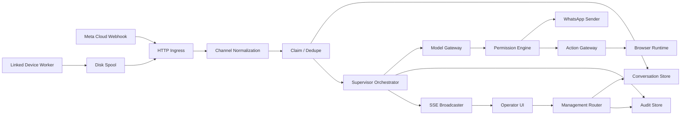
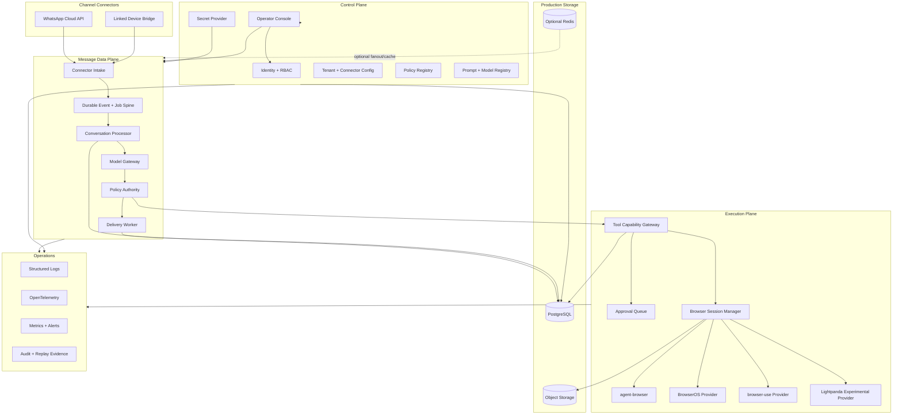

# WhatsApp AI Supervisor Enterprise Maturity Master Plan v2

> **For agentic workers:** REQUIRED SUB-SKILL: use `superpowers:subagent-driven-development` or `superpowers:executing-plans` to execute scoped implementation plans. Every behavior change follows TDD with a failing test first.

**Goal:** Mature WhatsApp AI Supervisor from a capable early product into a production-ready multi-tenant supervisor that can run locally, on a single VPS, or as a distributed deployment without changing domain behavior.

**Architecture:** Keep the current modular direction, but move correctness into explicit domain contracts and durable event processing. Separate the control plane, message data plane, execution plane, and observability plane. Prefer incremental migration over a rewrite.

**Tech stack direction:** Node.js 22/24 ESM, React + TypeScript UI, PostgreSQL as the production source of truth, S3-compatible object storage for media and execution artifacts, optional Redis for cache/fanout only when needed, OpenTelemetry, structured JSON logs, current WhatsApp Cloud API adapter, isolated linked-device worker, provider-based browser execution.

## Global Constraints

- Do not rewrite the application from scratch.
- Keep the existing Meta Cloud API and linked-device paths behind one canonical channel contract.
- Meta Cloud API is the preferred production connector. Linked-device support remains optional and isolated because it depends on unofficial WhatsApp Web automation.
- Local development must remain possible without PostgreSQL or external infrastructure through explicit development adapters.
- Production correctness must not depend on in-memory maps or local JSON/NDJSON files.
- The policy engine remains the final authority for every reply, proactive message, and external action.
- No model output can directly trigger a side effect without policy evaluation and a typed capability check.
- Do not persist or display raw model chain-of-thought. Persist structured reason codes, concise rationale summaries, inputs, outputs, model metadata, and policy decisions instead.
- No management or audit endpoint may be anonymously accessible in production.
- No credentials in URL query parameters.
- Every externally visible side effect must be idempotent, auditable, and correlated to the event that caused it.
- Every tenant boundary must be enforced server-side. UI filtering is never a security boundary.
- Browser sessions and connector credentials must be tenant isolated.
- Keep the current `tools/code-graph.mjs` deterministic graph. Add `code-review-graph` as a deeper semantic and blast-radius review layer rather than replacing the existing graph.
- Do not migrate package managers or backend language simply for consistency. Node/npm remain valid until a measured problem justifies a change.
- Kubernetes is not a prerequisite for production. A hardened Compose/VPS deployment is a first-class production target; Kubernetes is added only when scaling or operational requirements justify it.

---

## 1. Current Codebase Snapshot

The current repository is no longer a toy. It already has clear seams that should be preserved:

- 64 first-party modules and 111 import edges in the committed code graph, with zero import cycles.
- Separate Meta Cloud and linked-device transport adapters.
- A central `SupervisorOrchestrator` and `PermissionEngine` authority path for normal inbound messages.
- Model provider routing and fallback support.
- A browser runtime abstraction with local `agent-browser` and remote worker modes.
- Browser domain allowlists, bounded output, bounded task time, and stable hashed session IDs.
- Linked-device disk spooling, reconnection, per-session send pacing, and bounded send queues.
- An operator UI with tenant selection, inbox, takeover/release, manual replies, audit/actions pages, WhatsApp status, and SSE updates.
- Existing backend, worker, browser, deployment, and graph tests.
- Docker/Compose and CI across Node 22 and 24.

The maturity work should strengthen these seams, not erase them.

### Current request graph



### Current dependency graph strategy

Keep two complementary graph layers:

1. `tools/code-graph.mjs`
   - Fast and deterministic.
   - Import/export inventory.
   - Test import coverage.
   - Cycle detection.
   - Human-readable Mermaid output.

2. `tirth8205/code-review-graph`
   - Tree-sitter structural index.
   - Function/class/call/inheritance relationships.
   - Blast-radius analysis for changed files and functions.
   - Risk-scored pull-request review.
   - Incremental graph updates.

Target CI behavior:

```text
PR opened or updated
  -> normal lint/type/test/build checks
  -> tools/code-graph.mjs --check
  -> code-review-graph incremental build
  -> changed-symbol blast radius
  -> affected-test map
  -> risk report
  -> merge blocked only for configured high-risk conditions
```

---

## 2. Verified Risks From the Current Code

### P0 - Safety and correctness blockers

#### P0.1 Moderator dry-run can still create real side effects

`AutonomousModeratorEngine.moderateTenant({ dryRun: true })` calls `orchestrator.handle()` with the real tenant for unanswered inbound messages. `orchestrator.handle()` can send a real WhatsApp reply. Dry-run therefore does not currently guarantee dry execution.

**Required result:** one `ExecutionMode` contract (`live | shadow | simulation`) that is carried through orchestration, policy, sender, and tool execution. `simulation` must be incapable of calling external side-effect adapters.

#### P0.2 Proactive follow-ups bypass the policy authority

The proactive branch calls `orchestrator.modelGateway.decide()` directly and then calls the channel sender. That route bypasses `evaluatePermission()`.

**Required result:** every proactive message becomes a normal domain command that passes through the same policy and side-effect pipeline as inbound replies.

#### P0.3 Management authentication is optional

When `MANAGEMENT_TOKEN` is absent, the management router currently accepts requests. This is convenient locally but unsafe as a production default.

**Required result:** explicit runtime profiles:

- `development`: local bootstrap auth may be disabled only on loopback.
- `production`: service refuses to start without management identity configuration.

#### P0.4 SSE currently puts the management token in the URL

The UI uses `EventSource` with `?token=...`, and the backend accepts query-token authentication.

**Required result:** cookie/session authentication for the operator UI, or another SSE-compatible credential mechanism that never puts a secret in the URL.

#### P0.5 `/v1/simulate` and `/v1/audit` are outside management auth

These endpoints expose tenant behavior and audit data without the management authorization boundary.

**Required result:** move simulation and audit behind the authenticated control-plane API and enforce tenant authorization.

#### P0.6 Tenant updates can leave stale runtime objects

`server.js` caches senders and orchestrators by tenant ID. Updating tenant AI routes, policy, channel configuration, or credentials does not invalidate those objects.

**Required result:** versioned tenant configuration plus runtime lifecycle management. A runtime must either read an immutable config version per job or be invalidated when the version changes.

### P1 - Production durability and scale blockers

#### P1.1 File persistence is not a production source of truth

Tenant config, claims, audit records, and conversation events depend on local process memory or files. This prevents safe horizontal execution and creates locking, corruption, and recovery concerns.

#### P1.2 Conversation reads are scan-heavy

Conversation context and list operations derive state by reading tenant event files and filtering in memory. Cost increases with history size.

#### P1.3 Webhook work is synchronous

The Meta webhook path performs normalization, orchestration, model calls, policy evaluation, sending, audit, and response handling before returning. A slow model or downstream service can delay webhook acknowledgement.

#### P1.4 Side effects and audit writes are not atomic

A message can be sent before a later persistence operation fails. Retrying after a partial failure can create duplicate side effects unless idempotency is applied at the side-effect boundary.

#### P1.5 Model fallback has no provider health state

The model gateway already supports candidate fallback and retries, but it has no shared deadline, provider circuit state, retry jitter, cost budget, or structured telemetry.

#### P1.6 Raw thinking is exposed in the operator experience

The UI can display `message.thinking`. Production audit should keep decision evidence without storing or exposing private model reasoning traces.

### P2 - Product and operations gaps

- No durable workflow scheduler for proactive follow-ups.
- No first-class tool registry beyond browser capability execution.
- No approval queue for high-risk tool actions.
- No versioned policy/prompt/model configuration.
- No offline evaluation gate for prompt/model changes.
- No resumable event stream with durable event IDs.
- No operator roles or per-tenant authorization grants.
- No retention/export/delete controls for tenant data.
- No SLO dashboard, trace correlation, backup verification, or restore drill.

---

## 3. Target Architecture

### 3.1 Architectural planes



### 3.2 Control plane

Owns configuration and operator actions, not message processing:

- Authentication and sessions.
- Roles and tenant grants.
- Tenant and WhatsApp connector configuration.
- Policy versions.
- Prompt/model route versions.
- Tool permissions and approval rules.
- Secret references.
- Operator audit.
- Deployment/runtime status.

### 3.3 Message data plane

Owns customer conversation processing:

- Intake and validation.
- Canonical message normalization.
- Idempotency.
- Conversation state.
- Model decision requests.
- Policy evaluation.
- Reply/action command creation.
- Delivery state.
- Human handoff state.

The webhook handler should acknowledge after durable acceptance, not after an LLM round trip.

### 3.4 Execution plane

Owns external actions:

- Typed tools.
- Tool permission checks.
- Approval gates.
- Browser sessions.
- Network/domain controls.
- Concurrency and quotas.
- Execution artifacts and replay.

Models never receive a raw generic `execute anything` interface.

### 3.5 Observability plane

Every request/job carries:

- `requestId`
- `correlationId`
- `causationId`
- `tenantId`
- `conversationId`
- `eventId`
- `jobId` when applicable
- `configVersion`
- `policyVersion`
- `promptVersion`
- `modelRouteVersion`

---

## 4. Canonical Event Contract

Introduce one versioned event envelope before replacing storage adapters.

```ts
interface DomainEvent<TPayload = unknown> {
  eventId: string;
  eventType: string;
  schemaVersion: number;
  occurredAt: string;
  tenantId: string;
  conversationId?: string;
  messageId?: string;
  correlationId: string;
  causationId?: string;
  idempotencyKey?: string;
  actor: {
    type: 'customer' | 'ai' | 'operator' | 'connector' | 'scheduler';
    id?: string;
  };
  payload: TPayload;
}
```

Initial event vocabulary:

```text
connector.connected
connector.disconnected
connector.pairing_required
message.received
message.normalized
message.accepted
message.duplicate
conversation.control_changed
decision.requested
decision.completed
policy.evaluated
reply.requested
reply.sent
reply.failed
tool.requested
tool.approval_required
tool.approved
tool.denied
tool.completed
tool.failed
browser.session_started
browser.step_recorded
browser.session_completed
browser.session_failed
media.received
media.processed
human.handoff_requested
human.handoff_started
human.handoff_released
workflow.scheduled
workflow.completed
workflow.failed
```

Event schemas are validated at boundaries. Breaking schema changes require a new `schemaVersion` and migration/compatibility tests.

---

## 5. Core Contracts

Create ports before production adapters. The concrete names may stay JavaScript with JSDoc initially; a full backend TypeScript rewrite is not required.

### Persistence ports

```ts
interface TenantRepository {
  get(id: string): Promise<Tenant | null>;
  list(scope: TenantScope): Promise<Tenant[]>;
  create(input: TenantCreate): Promise<Tenant>;
  update(id: string, expectedVersion: number, patch: TenantPatch): Promise<Tenant>;
}

interface ConversationRepository {
  appendEvent(event: DomainEvent): Promise<void>;
  getConversation(tenantId: string, conversationId: string): Promise<Conversation>;
  listConversations(query: ConversationQuery): Promise<Page<ConversationSummary>>;
  getContext(query: ContextQuery): Promise<ConversationMessage[]>;
}

interface IdempotencyStore {
  acquire(key: string, ttlMs: number): Promise<boolean>;
  complete(key: string, resultRef?: string): Promise<void>;
  release(key: string): Promise<void>;
}

interface AuditRepository {
  append(entry: AuditEntry): Promise<void>;
  query(query: AuditQuery): Promise<Page<AuditEntry>>;
}
```

### Execution ports

```ts
interface ChannelAdapter {
  normalize(input: unknown): Promise<NormalizedInbound[]>;
  send(command: DeliveryCommand): Promise<DeliveryReceipt>;
  health(): Promise<ConnectorHealth>;
}

interface ModelProvider {
  decide(request: ModelDecisionRequest, signal: AbortSignal): Promise<ModelDecision>;
}

interface ToolProvider {
  execute(command: AuthorizedToolCommand, signal: AbortSignal): Promise<ToolResult>;
}

interface BrowserProvider {
  probe(): Promise<BrowserProviderHealth>;
  run(command: BrowserCommand, signal: AbortSignal): Promise<BrowserRunResult>;
}
```

### Workflow ports

```ts
interface EventPublisher {
  publish(events: DomainEvent[]): Promise<void>;
}

interface JobQueue {
  enqueue(job: JobCommand): Promise<void>;
  claim(workerId: string, limit: number): Promise<JobCommand[]>;
  ack(jobId: string): Promise<void>;
  retry(jobId: string, retryAt: string, reason: string): Promise<void>;
  deadLetter(jobId: string, reason: string): Promise<void>;
}
```

PostgreSQL can implement the first durable job queue using row locking and `SKIP LOCKED`. Redis/NATS/Kafka should not become correctness dependencies until throughput or fanout measurements require them.

---

## 6. Conversation and Handoff State

Replace scattered booleans with a state machine.

```text
AI_ACTIVE
  -> HUMAN_REQUESTED
  -> HUMAN_ACTIVE
  -> AI_ACTIVE

AI_ACTIVE
  -> PAUSED
  -> AI_ACTIVE

Any active state
  -> CLOSED
```

Rules:

- A conversation can have one control owner at a time.
- Human takeover is persisted before the UI reports success.
- AI jobs created before a takeover must re-check control ownership immediately before sending.
- Releasing to AI creates an explicit event and configuration snapshot.
- A scheduled follow-up re-checks conversation state, quiet hours, policy, and latest inbound activity before execution.

---

## 7. Policy and AI Decision Architecture

### 7.1 Policy remains deterministic authority

Model output is advisory. It can request less authority, never more.

Policy inputs should include:

- tenant policy version
- intent
- confidence
- requested action
- conversation control state
- customer tags/tier
- quiet hours/timezone
- message rate/budget
- tool risk tier
- connector capability
- approval requirement
- prior failed attempts

Policy output:

```ts
interface PolicyDecision {
  action: 'ignore' | 'draft' | 'reply' | 'act' | 'human';
  reasonCode: string;
  matchedRuleId?: string;
  requiresApproval: boolean;
  allowedCapabilityIds: string[];
  expiresAt?: string;
}
```

### 7.2 Model gateway

The current candidate fallback stays. Add:

- Shared request deadline via `AbortSignal`.
- Per-provider timeout.
- Exponential backoff with jitter for retryable failures only.
- Circuit breaker state by provider/model route.
- Structured schema validation of model decisions.
- Token/cost budget per route.
- Rate/quota errors separated from model/content errors.
- Provider/model health metrics.
- Model and prompt version metadata in every run.
- Redaction of secrets and unnecessary customer PII before external model calls.

Do not add more providers until these contracts cover the providers already present.

### 7.3 Prompt/model registry and evaluation

Every production decision should identify immutable versions:

```text
promptVersion
policyVersion
modelRouteVersion
businessContextVersion
```

Before a prompt/model route becomes default:

1. Run offline conversation fixtures.
2. Compare action accuracy, human handoff rate, unsafe-action rate, latency, and cost.
3. Run shadow mode against live traffic without side effects.
4. Canary a limited tenant or traffic percentage.
5. Roll back by configuration version, not code deployment.

### 7.4 No raw chain-of-thought storage

Replace `thinking` in user/operator-facing records with:

- `reasonCode`
- `rationaleSummary`
- `evidenceRefs`
- `confidence`
- `policyRuleId`
- `model/provider/version`

This gives operators useful evidence without keeping private reasoning traces.

---

## 8. Tool and Browser Platform

### 8.1 Capability registry

Replace the current browser-only action shape with a typed registry:

```ts
interface CapabilityDefinition {
  id: string;
  type: 'browser' | 'http' | 'crm' | 'calendar' | 'custom';
  risk: 'low' | 'medium' | 'high';
  inputSchema: JSONSchema;
  allowedTenants: string[] | '*';
  approval: 'never' | 'policy' | 'always';
  timeoutMs: number;
  rateLimit?: RateLimitPolicy;
}
```

Execution sequence:

```text
model requests capability
  -> schema validation
  -> policy authority
  -> capability lookup
  -> tenant grant
  -> approval gate when required
  -> execution quota
  -> provider execution
  -> result sanitization
  -> audit + artifact references
```

### 8.2 Browser provider roles

Do not force every browser job through one engine.

| Provider | Recommended role | Notes |
| --- | --- | --- |
| `agent-browser` | Default deterministic browser executor | Existing integration, domain bounds, compact accessibility refs, batch operations, local or worker execution |
| BrowserOS | Authenticated local workflows and operator-visible sessions | Useful for persistent logins, live inspection, and replay-oriented UX |
| `browser-use` | Optional high-level goal-driven worker | Keep behind a Python/remote provider boundary rather than importing Python concerns into the Node core |
| Lightpanda | Experimental lightweight extraction and compatible low-risk jobs | Treat as capability-detected fallback while browser/API coverage remains less complete than Chromium |

### 8.3 Browser security boundary

Every browser run gets:

- tenant ID
- immutable session ID
- capability ID
- egress allowlist
- private-network/loopback restrictions unless explicitly granted
- DNS rebinding protection
- maximum redirects
- maximum runtime
- maximum steps
- maximum output bytes
- artifact quota
- concurrency quota
- redaction policy
- cancellation signal

Persist an execution timeline and artifacts such as screenshots/HAR only when policy allows them. Artifacts inherit tenant retention rules.

### 8.4 Session lifecycle

```text
CREATED -> STARTING -> READY -> RUNNING -> COMPLETED
                     |          |
                     |          -> FAILED
                     -> DEGRADED
                     -> CLOSED
```

No cross-tenant cookie/profile reuse. Persistent authenticated profiles must be explicitly provisioned and encrypted at rest.

---

## 9. WhatsApp Connector Platform

### 9.1 Official Cloud connector

Treat the Meta Cloud API path as the production baseline:

- webhook signature required
- fast durable acceptance
- delivery status events
- media download/upload workers
- template message support where required
- connector-specific rate limits
- phone-number capability metadata
- Graph API version pinning and compatibility checks

### 9.2 Linked-device connector

Keep it as an isolated optional worker because it has different risk and lifecycle characteristics.

The current worker already has LocalAuth, reconnect, send pacing, queue bounds, and disk spooling. Mature it with:

- explicit session state machine
- health heartbeat and lease
- restart budget to avoid reconnect loops
- pairing expiry state
- durable connector events
- outbound idempotency keys
- delivery acknowledgement model
- media normalization
- worker process supervision
- encrypted auth profile storage or volume-level encryption
- remote worker mutual authentication
- clear operator warning that this connector uses unofficial WhatsApp Web automation

Do not couple the core domain to `whatsapp-web.js` objects or browser internals.

---

## 10. Data Model and Persistence

PostgreSQL becomes the production source of truth.

### Core tables

```text
tenants
tenant_config_versions
operators
operator_tenant_grants
connectors
connector_sessions
conversations
messages
conversation_events
decisions
policy_versions
prompt_versions
model_route_versions
model_runs
delivery_commands
delivery_receipts
tool_runs
browser_sessions
media_assets
jobs
job_attempts
idempotency_keys
audit_events
```

### Persistence rules

- Every row containing customer data has `tenant_id`.
- Queries require tenant scope in repository APIs.
- Add database constraints for tenant ownership and unique idempotency keys.
- Use cursor pagination for messages, conversations, and audit events.
- Add indexes from real query plans, not assumptions.
- Keep files as development adapters only.
- Tenant configuration mutations use optimistic concurrency via `version`.
- Store media and browser artifacts outside Postgres; Postgres stores metadata and object references.
- Redis is optional for cache or fanout. Loss of Redis must not lose accepted messages or audit records.

### Migration approach

1. Define repository contracts around current file stores.
2. Add contract tests that run against file adapters.
3. Implement PostgreSQL adapters against the same contract tests.
4. Add dual-write shadow verification in non-production fixtures if useful.
5. Switch production runtime by explicit adapter configuration.
6. Keep a rollback path until data parity checks pass.

---

## 11. Security Architecture

### Identity and operator sessions

Preferred production path:

- OIDC-compatible identity provider.
- HttpOnly, Secure, SameSite session cookies for the operator console.
- CSRF protection for state-changing browser requests.
- Roles: `owner`, `admin`, `operator`, `viewer`, plus tenant grants.
- Short-lived sessions with server-side revocation.
- Local bootstrap admin only for local/VPS installation setup.

### Secrets

- Tenant config stores secret references, never raw API keys.
- Support environment references for local use.
- Add pluggable KMS/Vault/secret-manager provider later without changing domain contracts.
- Redact secrets from logs, traces, audit metadata, errors, screenshots, and browser artifacts.
- Rotation changes a secret version without editing unrelated tenant configuration.

### Prompt injection and tool safety

Customer messages, web pages, media text, documents, and retrieved content are untrusted data.

Rules:

- Never concatenate untrusted content into privileged control instructions.
- Model tool requests must be structured and schema validated.
- Tool output is untrusted when it originates from external pages/services.
- Tool grants are tenant and capability scoped.
- High-risk actions can require operator approval.
- Browser and HTTP tools enforce egress rules independently from model instructions.
- No generic shell tool in the production capability catalog.

### Error and data exposure

- Production errors return stable public error codes and request IDs, not internal exception text.
- UI renders customer content as text by default.
- Audit export follows operator role and tenant scope.
- Define retention, export, and delete jobs for conversations, media, model runs, and browser artifacts.

---

## 12. Operator UI/UX Product Plan

Do not start with cosmetic redesign. Mature operator workflows first.

### Primary navigation

```text
Overview
Inbox
Approvals
WhatsApp
Browser Sessions
Policies
AI & Prompts
Audit
Analytics
Tenants
Settings
```

### Overview

Show action-oriented state:

- connector outages
- unprocessed job backlog
- human handoff queue
- approval queue
- failed deliveries
- provider health
- browser capacity
- recent configuration changes

Avoid decorative charts that do not help an operator decide what to do.

### Inbox

Keep current useful behavior and add:

- durable cursor pagination
- tenant-scoped search
- assignment/owner state
- explicit `AI active`, `human requested`, `human active`, `paused` states
- unread state
- failed-send state with retry
- side panel for customer/context metadata
- decision reason summary without raw chain-of-thought
- pending scheduled follow-up indicator
- cancel follow-up action
- keyboard workflow for operators
- event-stream reconnection with resume cursor

### Approvals

A new first-class queue:

- requested tool/action
- risk tier
- customer/conversation context
- exact side effect proposed
- expiry
- approve / deny / edit within policy
- auditable operator identity

### WhatsApp onboarding and health

- Cloud API setup checklist and validation.
- Linked-device QR/pairing with connection-state history.
- Number/session capability view.
- Test message with explicit simulation/live distinction.
- Connector version and last heartbeat.

### Policy editor

Prefer a structured form and simulator before a drag-and-drop canvas.

- rule list
- priority/order
- confidence threshold
- quiet hours
- capability grants
- approval requirements
- test message simulator
- diff before publish
- immutable version after publish
- rollback to a prior version

### Browser sessions

- current runs
- provider/engine
- tenant/conversation/capability
- live state where provider supports it
- step timeline
- artifacts
- cancellation
- replay/evidence view
- redaction indicator

### Audit

- cursor pagination
- tenant/date/actor/action filters
- correlation timeline
- config/policy/prompt/model version links
- side-effect receipts
- export with authorization checks

---

## 13. Observability and SRE

### Structured logs

Replace ad-hoc `console.*` with one logger interface and JSON output.

Every log line carries correlation metadata. Do not log full customer content by default.

### Tracing

OpenTelemetry spans:

```text
http/webhook
  -> intake.accept
  -> job.claim
  -> conversation.process
  -> model.decide
  -> policy.evaluate
  -> delivery.send OR tool.execute
  -> persistence.commit
```

Propagate trace context to linked-device and browser workers.

### Metrics

Keep low-cardinality infrastructure metrics in Prometheus/OpenTelemetry. Do not put unbounded customer IDs or conversation IDs in metric labels.

Important metrics:

- webhook acceptance latency
- job queue delay
- decision latency by provider/route
- provider error rate
- policy action counts
- delivery success/failure
- duplicate suppression count
- tool/browser execution latency
- browser pool saturation
- linked-device connection state
- SSE connected clients
- database pool saturation

Tenant-level product analytics belong in queryable storage, not high-cardinality metric labels.

### Proposed initial SLOs

These are release targets, not claims about current behavior:

| Area | Initial target |
| --- | --- |
| Durable webhook acceptance | p95 < 500 ms under expected load |
| Non-tool AI decision | p95 < 8 s for healthy configured providers |
| Operator read APIs | p95 < 300 ms for normal paginated queries |
| Duplicate external side effects | 0 known duplicates caused by retry paths |
| Audit coverage | 100% of external side effects have a correlated audit record |
| Cross-tenant access | 0 accepted violations in automated isolation tests |
| Production availability target | 99.9% for the supervisor API after readiness criteria are met |
| RPO | <= 5 minutes |
| RTO | <= 30 minutes for documented single-region recovery |

---

## 14. Test Guard

Keep `node:test` unless a concrete testing need requires another runner. The important change is test architecture and merge gates, not package-manager churn.

### Required test layers

| Layer | Purpose |
| --- | --- |
| Domain unit tests | policy, state machines, idempotency, event transitions |
| Adapter contract tests | file/Postgres repositories, channel adapters, model providers, browser providers |
| HTTP integration tests | auth, tenant scope, content type, rate limit, errors, webhook acceptance |
| Worker integration tests | linked-device spool, reconnect, delivery retry, browser worker protocol |
| UI component tests | operator state transitions and dangerous-action confirmations |
| E2E tests | Cloud webhook -> decision -> delivery receipt; human takeover; approval flow; linked-device ingress |
| Failure tests | provider timeout, DB disconnect, worker crash, retry, duplicate webhook, partial send failure |
| Security tests | tenant isolation, auth bypass, CSRF, SSRF/private-network browser denial, secret redaction |
| Load tests | webhook bursts, conversation pagination, job backlog recovery, SSE fanout |

### TDD rule

Every behavior task follows:

```text
RED: add one failing behavior test
VERIFY RED: confirm it fails for the expected reason
GREEN: smallest implementation that satisfies the behavior
VERIFY GREEN: targeted test plus affected suite
REFACTOR: improve structure without changing behavior
GRAPH REVIEW: inspect blast radius for changed symbols
COMMIT: one reviewable change
```

### Test guard rules

- Never change an assertion only to make a failing implementation pass without a requirement change.
- Every bug fix includes a regression test that fails on the prior behavior.
- Permission and state-machine tests include boundary cases and invalid transitions.
- Adapter contract suites run against every production adapter.
- High-risk policy code uses mutation testing or equivalent fault-seeding checks before release.
- Tests do not make live WhatsApp/model/browser calls in normal CI.
- Production-like integration tests run against disposable Postgres/object-store containers.
- Flaky tests are quarantined only with an issue and owner; they are not silently retried forever.

---

## 15. Clean Code Guard

Replace arbitrary style rules with architecture rules that protect correctness.

### Dependency rules

```text
Domain
  must not import HTTP, database clients, browser CLIs, React, or provider SDKs

Application services
  may depend on domain ports
  must not construct infrastructure clients directly

Infrastructure adapters
  implement domain/application ports

HTTP/UI adapters
  translate transport payloads to application commands
```

### Code quality rules

- No silent `catch {}` in production paths unless the failure is explicitly optional and documented.
- Do not require try/catch around every async function. Catch only where recovery, translation, logging context, or cleanup is added.
- Use typed/domain error classes and stable public error codes.
- Prefer small cohesive modules, but do not enforce a blind line-count ceiling.
- Keep side effects behind interfaces.
- Validate untrusted inputs once at boundaries with schemas.
- Use immutable configuration snapshots during job execution.
- Use dependency injection for clock, ID generation, network clients, and stores where tests need deterministic behavior.
- No hidden global mutable state for tenant-specific behavior.
- No raw secrets or customer message text in default logs.
- No direct model-provider calls from feature code; all model decisions go through `ModelGateway`.
- No direct sender/tool calls from AI feature code; all side effects go through the authorized command path.

### Static/CI checks

Add progressively:

- ESLint with architecture/import restrictions.
- Type checking via JSDoc/TypeScript where modules are touched.
- `npm audit` plus dependency review.
- secret scanning.
- SBOM generation for release images.
- container vulnerability scan.
- `tools/code-graph.mjs --check`.
- `code-review-graph` risk/blast-radius report.

---

## 16. Delivery Roadmap

This roadmap is sequenced by risk and dependency. It is intentionally not a calendar estimate.

### Phase 0 - Stop unsafe behavior and establish the safety net

**Purpose:** make the current application safe enough to keep evolving.

**Deliverables:**

- Fix moderator dry-run so simulation cannot send.
- Route proactive follow-ups through policy authority.
- Move `/v1/simulate` and `/v1/audit` behind control-plane authorization.
- Remove query-string token auth and change SSE auth strategy.
- Make production management auth mandatory.
- Add production-safe error responses.
- Add request/correlation IDs.
- Add structured logger interface.
- Add tenant runtime cache invalidation/config versioning minimum viable path.
- Add explicit execution mode to sender/tool adapters.
- Add regression tests for every P0 finding.
- Integrate `code-review-graph` in review-only mode first.

**Exit gate:**

- Simulation tests prove zero sender/tool calls.
- Proactive messages cannot bypass policy in tests.
- Anonymous control-plane/audit access is denied in production profile tests.
- No URL carries a management secret.
- Existing backend/UI/worker CI remains green.

### Phase 1 - Domain contracts, event spine, and state machines

**Purpose:** define the stable boundaries that later adapters can implement.

**Deliverables:**

- Canonical `DomainEvent` schema and event vocabulary.
- Conversation control state machine.
- Delivery state machine.
- Connector session state machine.
- Repository ports.
- Event publisher and job queue ports.
- Channel/model/tool/browser provider contracts.
- Structured error taxonomy.
- Current file adapters moved behind contracts.
- Durable-accept webhook flow using a development queue adapter.
- Contract and state-transition tests.

**Exit gate:** application/domain code can run in tests without real files, HTTP servers, model SDKs, browsers, or WhatsApp workers.

### Phase 2 - PostgreSQL production persistence and durable jobs

**Purpose:** remove local-file correctness dependencies from production.

**Deliverables:**

- Migrations and schema.
- PostgreSQL repositories.
- Postgres-backed idempotency.
- Postgres-backed jobs with retry schedule and dead-letter state.
- Transactional outbox where a state change and emitted event must be atomic.
- Cursor pagination.
- Tenant configuration versions and optimistic concurrency.
- Object storage adapter for media/browser artifacts.
- Backup, restore, migration rollback, and data parity tests.

**Exit gate:** two supervisor processes can safely process work against the same database without duplicate side effects or lost accepted events in integration tests.

### Phase 3 - Connector maturity

**Purpose:** make WhatsApp connectivity operationally reliable.

**Deliverables:**

- Cloud connector delivery receipts and media support.
- Fast webhook durable acceptance.
- Cloud connector health/capability model.
- Linked-device session lease/heartbeat.
- Linked-device outbound idempotency.
- Reconnect budgets and degraded states.
- Pairing lifecycle exposed to UI.
- Connector worker authentication hardening.
- Connector-specific load/failure tests.

**Exit gate:** connector restart, duplicate webhook, transient outage, and reconnect tests recover without duplicate customer-facing replies.

### Phase 4 - AI and policy platform

**Purpose:** make model changes measurable and side effects governable.

**Deliverables:**

- Typed model decision schema.
- Shared deadline/cancellation.
- Provider circuit breakers and retry classification.
- Cost/token budgets.
- Policy v2 inputs and reason codes.
- Versioned prompts/model routes/policies.
- Offline evaluation fixtures and report.
- Shadow/canary configuration.
- Moderator rebuilt as scheduled workflow commands, not direct model/sender calls.
- Remove raw thinking from storage/UI contracts.

**Exit gate:** a model or prompt version cannot become default without an evaluation report and can be rolled back by configuration version.

### Phase 5 - Capability and browser execution platform

**Purpose:** support controlled external work beyond text replies.

**Deliverables:**

- Capability registry.
- Tool authorization service.
- Approval queue.
- Browser session manager and quotas.
- `agent-browser` provider hardened as default deterministic executor.
- Remote browser worker protocol versioning.
- BrowserOS provider for authenticated/operator-visible local workflows where appropriate.
- `browser-use` remote provider for high-level browser agents where appropriate.
- Lightpanda experimental provider with capability detection and fallback.
- SSRF/private-network and egress tests.
- Execution artifacts and replay metadata.

**Exit gate:** an untrusted message or page cannot make the agent reach an ungranted domain/capability in automated adversarial tests.

### Phase 6 - Operator control plane and UI workflows

**Purpose:** make the product manageable by a real support/operations team.

**Deliverables:**

- OIDC/session auth and tenant RBAC.
- Tenant/config version UI.
- Mature inbox state model.
- Approval queue UI.
- Policy simulator/publish/rollback.
- Connector onboarding and health.
- Browser session timeline/replay.
- Correlated audit timeline.
- Event stream resume behavior.
- Accessible responsive operator workflows.

**Exit gate:** an operator can diagnose a failed reply, take over a conversation, inspect the decision evidence, approve/deny a side effect, and trace the result without server-shell access.

### Phase 7 - Observability, reliability, and data governance

**Purpose:** make incidents diagnosable and recovery repeatable.

**Deliverables:**

- Structured JSON logging.
- OpenTelemetry traces.
- Low-cardinality metrics and alerts.
- SLO dashboard.
- Graceful shutdown/drain.
- Job backlog recovery tests.
- Backup verification and restore drill.
- Retention/export/delete jobs.
- Security event audit.
- Runbooks for connector, provider, DB, queue, and browser failures.

**Exit gate:** a staged outage can be detected, traced, recovered, and documented using normal operator/SRE tooling.

### Phase 8 - Release and deployment maturity

**Purpose:** make local, VPS, and distributed releases reproducible.

**Deliverables:**

- Hardened multi-stage images.
- Non-root containers where compatible.
- Compose production profile with health/readiness checks.
- Explicit local profile.
- Database migration job.
- Image signing/SBOM/provenance.
- Staging release workflow.
- Canary/rollback procedure.
- Kubernetes manifests or Helm only after a real multi-node requirement exists.

**Exit gate:** a clean host can install, upgrade, roll back, back up, and restore a release using documented commands and CI-produced artifacts.

---

## 17. Superpowers Workstream Decomposition

Do not execute this entire master plan as one giant agent task. Each workstream gets its own design/spec and implementation plan.

Recommended sequence:

```text
1. docs/superpowers/specs/2026-08-17-safety-hardening-design.md
   docs/superpowers/plans/2026-08-17-safety-hardening.md

2. docs/superpowers/specs/2026-08-17-event-spine-domain-contracts-design.md
   docs/superpowers/plans/2026-08-17-event-spine-domain-contracts.md

3. docs/superpowers/specs/2026-08-17-postgres-durable-jobs-design.md
   docs/superpowers/plans/2026-08-17-postgres-durable-jobs.md

4. docs/superpowers/specs/2026-08-17-whatsapp-connector-platform-design.md
   docs/superpowers/plans/2026-08-17-whatsapp-connector-platform.md

5. docs/superpowers/specs/2026-08-17-ai-policy-platform-design.md
   docs/superpowers/plans/2026-08-17-ai-policy-platform.md

6. docs/superpowers/specs/2026-08-17-tool-browser-platform-design.md
   docs/superpowers/plans/2026-08-17-tool-browser-platform.md

7. docs/superpowers/specs/2026-08-17-operator-control-plane-design.md
   docs/superpowers/plans/2026-08-17-operator-control-plane.md

8. docs/superpowers/specs/2026-08-17-sre-data-governance-design.md
   docs/superpowers/plans/2026-08-17-sre-data-governance.md

9. docs/superpowers/specs/2026-08-17-release-deployment-design.md
   docs/superpowers/plans/2026-08-17-release-deployment.md
```

For each implementation plan:

1. Create or verify an isolated worktree.
2. Create the SDD progress ledger.
3. Use one fresh implementer subagent per task.
4. Follow RED -> GREEN -> REFACTOR.
5. Generate a task diff/review package.
6. Review spec compliance and code quality separately.
7. Query code-review-graph for blast radius and affected tests.
8. Fix findings before the task is marked complete.
9. Run a broad branch review at the end.
10. Merge only when tests, graph checks, security checks, and the workstream exit gate pass.

---

## 18. First Implementation Plan: Safety Hardening

This should be the next detailed plan because it removes current unsafe behavior without requiring a database rewrite.

### Task 1 - Execution mode contract

**Files:**
- Create `src/domain/execution-mode.js`
- Modify `src/core/orchestrator.js`
- Modify channel sender/action gateway interfaces as required
- Test `tests/execution-mode.test.js`

**Behavior:** `simulation` and `shadow` can compute decisions but cannot call external senders or tools.

### Task 2 - Moderator authority fix

**Files:**
- Modify `src/ai/moderator-engine.js`
- Modify `src/core/orchestrator.js` only if required by the command interface
- Test `tests/moderator-engine.test.js`

**Behavior:** proactive follow-up commands pass through policy and execution mode. Dry-run cannot send.

### Task 3 - Control-plane auth boundary

**Files:**
- Modify `src/app.js`
- Modify `src/management/router.js`
- Modify `ui/src/api/client.ts`
- Modify `ui/src/hooks/useRealtime.ts`
- Add auth integration tests

**Behavior:** audit/simulation/control-plane APIs require production auth; no query token is accepted.

### Task 4 - Production profile and safe errors

**Files:**
- Modify `src/config.js`
- Modify `src/app.js`
- Modify `src/server.js`
- Add config and HTTP error tests

**Behavior:** production refuses unsafe auth configuration and never sends arbitrary internal exception details to clients.

### Task 5 - Runtime config invalidation

**Files:**
- Modify `src/server.js`
- Modify `src/core/tenant-store.js` or introduce a focused runtime registry
- Modify management tenant mutation path
- Add runtime refresh tests

**Behavior:** tenant policy/AI/channel changes take effect on the next command without process restart and cannot reuse a deleted tenant runtime.

### Task 6 - Structured logging and correlation IDs

**Files:**
- Create `src/infra/logger.js`
- Create `src/infra/request-context.js`
- Modify `src/app.js`, `src/server.js`, worker logging entrypoints
- Add logging/context tests

**Behavior:** every HTTP/job flow has a correlation ID and production logs are structured/redacted.

### Task 7 - Code graph review gate

**Files:**
- Keep `tools/code-graph.mjs`
- Add code-review-graph configuration/workflow
- Modify `.github/workflows/ci.yml`
- Add/update graph checks

**Behavior:** import graph freshness and semantic blast-radius review are both available on pull requests.

### Safety hardening final gate

Run:

```text
npm run check
npm run ui:check
npm run graph:check
linked-device worker checks
Docker image builds
security-focused integration tests
code-review-graph risk report
```

Then perform a whole-branch review before merge.

---

## 19. Enterprise Readiness Definition

The project can be called enterprise-ready only when all of the following are true:

### Tenant isolation

- Every read/write is tenant scoped.
- Automated cross-tenant tests cover API, event, DB, media, browser, and audit paths.

### Durability

- Accepted messages survive process restart.
- Retry does not duplicate external side effects.
- Database backup and restore are tested.

### Security

- Production identity is mandatory.
- Roles and tenant grants are enforced server-side.
- No secrets in URLs/logs/audit exports.
- Tool/browser actions are capability scoped and policy checked.
- External/untrusted content cannot alter privileged instructions or execution grants.

### Operability

- Operators can see connector/provider/job/browser health.
- Correlation IDs connect UI, logs, traces, and audit records.
- Runbooks exist for the common failure modes.

### Change safety

- TDD and adapter contract tests cover changed behavior.
- Prompt/model/policy changes are versioned and evaluated.
- Code graph and blast-radius checks run on PRs.
- Releases have rollback procedures.

### Product usability

- Operator workflows work on desktop and narrow screens.
- Human takeover is explicit and durable.
- Dangerous actions have clear confirmation/approval UX.
- Audit explains what happened without exposing raw private model reasoning.

### Deployment

- Local mode is easy for development.
- Single-VPS production mode is documented and hardened.
- Distributed mode uses the same domain contracts and data model.
- Scaling does not require changing customer-facing behavior.

---

## 20. Reference Adoption Map

| Reference | Adopt | Do not copy blindly |
| --- | --- | --- |
| `tirth8205/code-review-graph` | AST graph, blast radius, affected-test map, PR risk review | Do not replace the current deterministic import graph |
| `wwebjs/whatsapp-web.js` | LocalAuth/session events, media capability, linked-device lifecycle ideas | It is an unofficial WhatsApp Web route, so keep it isolated and optional |
| `mautrix/whatsapp` | Long-running bridge boundaries and connector lifecycle thinking | Do not import Matrix-specific domain concepts into the core |
| `lharries/whatsapp-mcp` | Separate bridge/tool surface, local indexed message model, explicit message/media tools | MCP tools need strict prompt-injection and data-exfiltration controls in a business product |
| `Matt-Fontes/SendScriptWhatsApp` | Simple pacing/batching lesson only | Browser-console script injection is not an architecture for this product |
| `vercel-labs/agent-browser` | Deterministic refs, domain/content boundaries, batch execution, network inspection, session handles | Keep CLI/process details behind `BrowserProvider` |
| `browser-use/browser-use` | High-level task worker, custom tools, profile concepts | Keep Python runtime and autonomous browser logic outside the Node domain core |
| `browseros-ai/BrowserOS` | Authenticated profiles, operator-visible sessions, live/replay UX | Do not make a desktop browser mandatory for VPS execution |
| `lightpanda-io/browser` | Lightweight CDP/MCP execution, isolated sessions, deterministic replay ideas | Treat as experimental for compatibility-sensitive production tasks while coverage is still developing |

---

## Final Direction

The next maturity step is not "add PostgreSQL, Redis, Kubernetes, more LLMs, and more pages." The next step is to make every message and action move through one durable, observable, tenant-scoped authority path.

Once that is true, storage adapters, browser providers, new model vendors, media, analytics, and larger deployments become replaceable components instead of new sources of hidden coupling.
