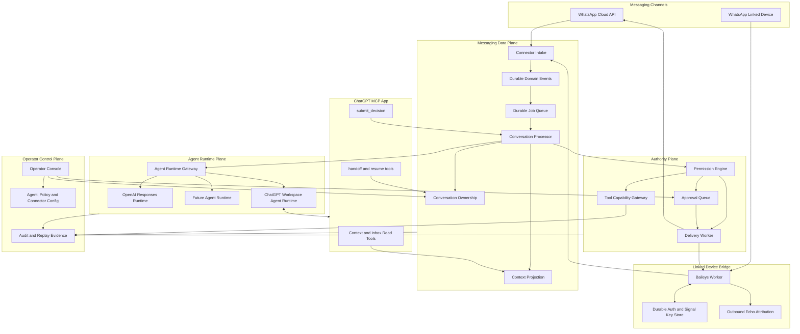
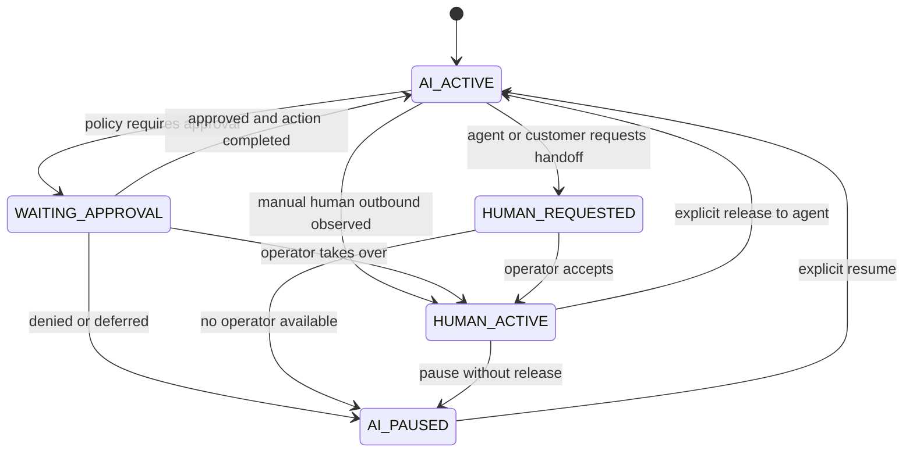
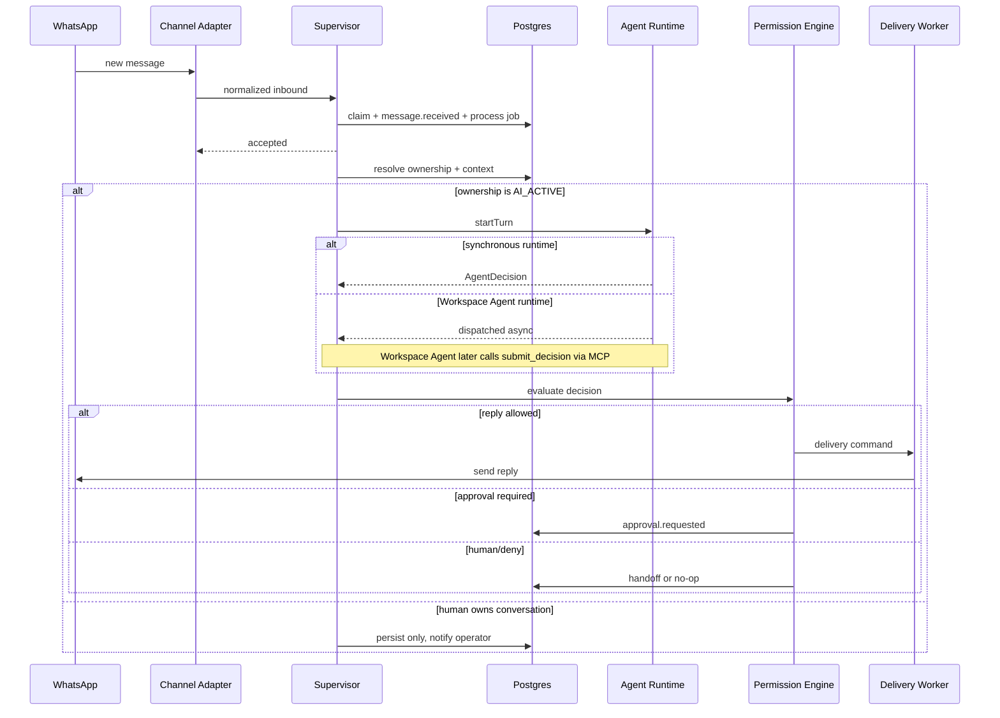
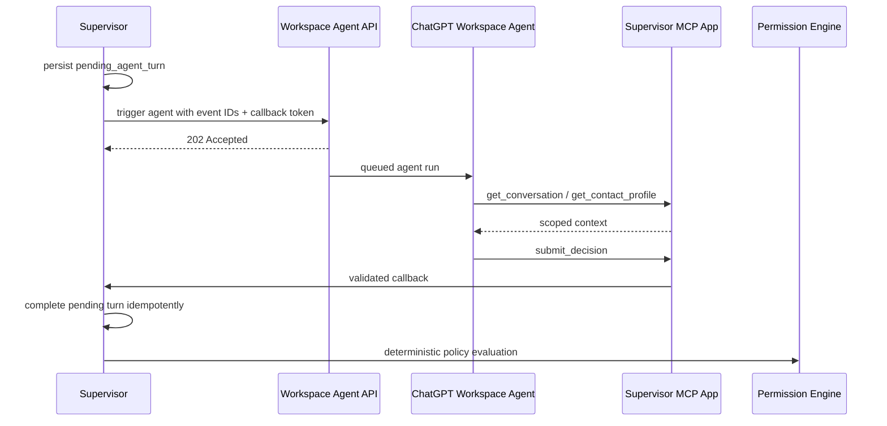

# ChatGPT Messaging Agent Architecture

Status: proposed target architecture

Date: 2026-08-27

## Product definition

WhatsApp AI Supervisor should evolve from a model-routed WhatsApp automation service into an agent-runtime-independent messaging control plane.

The core product statement is:

> ChatGPT is the agent. WhatsApp is a communication channel.

The goal is not to create another WhatsApp chatbot that sends each message to an LLM and returns generated text. The goal is to let a persistent ChatGPT agent represent the operator on an existing business WhatsApp account, within explicit policy and human-control boundaries.

A successful deployment should let the operator pair the business WhatsApp account through the normal Linked Devices flow, then allow the agent to:

- receive new conversations
- understand who is speaking and what happened previously
- use business context, files, apps, skills, and allowed tools
- reply in the operator's communication style
- continue conversations across minutes, days, and restarts
- distinguish safe conversational replies from consequential commitments
- ask for approval when policy requires it
- stop when the operator manually takes over a conversation
- resume only when ownership returns to the agent
- keep a durable, auditable record of message, decision, policy, approval, and delivery events

This architecture preserves the existing supervisor rule: the agent can propose behavior, but deterministic policy owns authority over every external side effect.

## Feasibility and current platform constraint

The concept is technically feasible, but there are two different meanings of "use ChatGPT" that must not be confused.

### Exact ChatGPT Workspace Agent path

ChatGPT Workspace Agents can be triggered programmatically from an external service and can use reusable instructions, connected context, apps, custom MCP tools, skills, files, and web tools.

As of 2026-08-27, the Workspace Agent API trigger is asynchronous. It queues a run and returns HTTP `202 Accepted` with no response body, no run ID, and no API for retrieving the final agent response.

Therefore the supervisor must not model this integration as a synchronous request-response call.

The recommended pattern is:

1. WhatsApp message enters the supervisor and is persisted.
2. The supervisor triggers the Workspace Agent with a correlation token and concise event payload.
3. The Workspace Agent reads additional context through the supervisor's MCP app when needed.
4. The Workspace Agent calls a supervisor MCP write tool such as `submit_decision`.
5. The supervisor validates the callback, resolves the pending turn, applies deterministic policy, and performs or queues the permitted side effect.

This callback design preserves the actual Workspace Agent as the reasoning identity while keeping the supervisor as the authority boundary.

### OpenAI Responses fallback path

For environments where Workspace Agents are not available, the existing OpenAI Responses provider remains a valid runtime. It can share the same business context, contact memory, style profile, and tool contract, but it is not literally the same ChatGPT Workspace Agent identity.

The architecture therefore defines an `AgentRuntime` boundary rather than making Workspace Agents or Responses API a core dependency.

## Design principles

1. **Channel and agent are independently replaceable.** WhatsApp transport must not know whether the decision runtime is a Workspace Agent, Responses API, Codex-style runtime, or another provider.
2. **The supervisor owns authority.** No runtime can grant itself permission to send, commit, purchase, modify, or execute.
3. **Durable acceptance before agent work.** Connector acknowledgement must follow durable event/job acceptance, not an LLM round trip.
4. **Conversation ownership is explicit state.** Human and AI must never unknowingly reply over each other.
5. **Manual operator activity wins immediately.** A human message sent from the paired WhatsApp account moves the conversation to human ownership unless the event is an echo of a supervisor-originated send.
6. **Identity is persistent, transport state is not identity.** QR credentials prove access to the WhatsApp account; they do not define the agent persona or memory.
7. **Context is scoped by contact and tenant.** Information learned from one external contact must not bleed into another contact unless it is explicitly promoted to trusted business knowledge.
8. **Every side effect is attributable.** Events carry correlation, causation, actor, runtime, policy version, and origin metadata.
9. **Linked-device transport is isolated.** Unofficial WhatsApp Web connectivity stays outside the supervisor process and can be replaced without changing domain behavior.
10. **No ChatGPT UI automation.** The architecture uses supported API/MCP surfaces rather than browser-driving the ChatGPT web application.

## Reference patterns

### NanoClaw

Useful patterns:

- channels are installed adapters rather than hardwired business logic
- Baileys is used for direct WhatsApp Web connectivity
- QR/pairing auth is separate from agent execution
- messaging groups route to agent groups and sessions
- agent execution is isolated from the host transport process
- per-session inbound/outbound durability reduces transport-agent coupling
- shared/personal WhatsApp numbers require different engagement semantics

What we do differently:

- the business-number use case must allow external DMs to reach the agent according to policy
- policy and conversation ownership remain centralized in WhatsApp AI Supervisor
- we do not make the agent container the final authority for outbound actions

### Brigade

Useful patterns:

- a long-running gateway owns durable agent state while messaging clients stay thin
- all inbound channels resolve through one routing path
- channel sessions do not share context accidentally
- long-term memory has origin scoping
- privileged tool actions can require approval
- WhatsApp uses Baileys with reconnect discipline, LID handling, typing state, read receipts, replies, and media

What we do differently:

- we keep the existing supervisor event spine and Permission Engine
- we use an explicit conversation-ownership state machine for business messaging
- the primary identity target is a ChatGPT Workspace Agent, not an embedded multi-agent crew

### wechat-bot

Useful patterns:

- the project acts as a runtime shell around an agent while IM is the external communication surface
- channel selection and agent selection are independent
- the same agent abstraction can receive events from multiple messaging platforms
- webhook-based channels acknowledge quickly and continue agent work after acknowledgement
- local captured conversation data can be used for analysis and agent context

What we do differently:

- default agent execution must be persistent, not one isolated single-turn invocation per message
- in-memory dedupe is replaced by the existing durable Postgres/event contracts
- model routing is replaced at the top level by an `AgentRuntime` contract
- outbound behavior always passes through policy and ownership checks

### Baileys

Useful patterns:

- direct WebSocket connection without Selenium or Chromium
- normal WhatsApp Linked Devices QR and pairing-code authentication
- multi-device support
- event-driven inbound handling
- replies, media, reactions, read state, and presence
- persistent auth state with key updates
- production deployments should implement durable auth/key storage rather than treating the sample multi-file helper as a production database

Baileys remains an unofficial WhatsApp Web client. Linked-device mode must be opt-in, rate-limited, observable, and clearly separated from the official Cloud API path.

## Target architecture



## Component boundaries

### 1. Messaging channel adapters

The canonical `ChannelAdapter` remains responsible for transport only:

```ts
interface ChannelAdapter {
  normalize(input: unknown): Promise<NormalizedInbound[]>;
  send(command: DeliveryCommand): Promise<DeliveryReceipt>;
  health(): Promise<ConnectorHealth>;
}
```

It must not:

- compose agent prompts
- decide whether to reply
- evaluate business permissions
- own conversation memory
- infer whether a human or AI should currently control the chat

### 2. Baileys linked-device worker

The current `whatsapp-web.js` worker should remain supported during migration. A Baileys worker becomes the preferred linked-device v2 implementation behind the same external transport contract.

Responsibilities:

- QR and pairing-code lifecycle
- persistent auth and Signal key state
- socket reconnect with bounded backoff
- inbound event normalization
- media acquisition after admission policy permits it
- read receipts and typing/presence state
- outbound send execution
- returning WhatsApp message IDs for correlation
- observing `fromMe` events from all linked devices
- emitting unmatched human outbound activity to the supervisor

The worker must not decide that a `fromMe` event is human solely from the flag. Every supervisor-originated outbound message is registered in an outbox attribution store. When WhatsApp echoes the sent event, the worker/supervisor matches the platform message ID and marks it as `agent` or `operator_api` origin. An unmatched `fromMe` message from the linked account is treated as a human message and can trigger takeover.

### 3. Agent Runtime Gateway

Introduce an agent-level boundary above the existing model providers.

```ts
type AgentRuntimeKind =
  | 'chatgpt-workspace-agent'
  | 'openai-responses'
  | 'future';

interface AgentRuntime {
  startTurn(input: AgentTurnInput, signal: AbortSignal): Promise<AgentTurnDispatch>;
  health(): Promise<AgentRuntimeHealth>;
}

interface AgentTurnInput {
  tenantId: string;
  conversationId: string;
  eventId: string;
  correlationId: string;
  message: NormalizedInbound;
  contextSummary: ConversationContextSummary;
  allowedCapabilityHints: ModelVisibleCapability[];
  callbackToken?: string;
}

type AgentTurnDispatch =
  | { mode: 'synchronous'; decision: AgentDecision }
  | { mode: 'asynchronous'; dispatchId: string | null; expiresAt: string };
```

The existing `ModelGateway` can implement the synchronous Responses runtime under this contract without being deleted.

### 4. Workspace Agent runtime

The Workspace Agent adapter dispatches an external agent run and records a `pending_agent_turn` before the trigger request.

The trigger payload should contain only what the agent needs to route the turn:

```json
{
  "tenantId": "business-a",
  "conversationId": "wa:2010...",
  "eventId": "evt_...",
  "correlationId": "corr_...",
  "callbackToken": "opaque-short-lived-token",
  "instruction": "Handle the new WhatsApp message using the Messaging Supervisor tools. Submit exactly one final decision for this event."
}
```

Do not serialize the entire customer history into every trigger. The agent can fetch scoped context through MCP read tools.

### 5. ChatGPT MCP app

The supervisor exposes a remote MCP app to ChatGPT/Workspace Agents. For private deployments it can be connected through a supported secure tunnel rather than opening the management plane directly to the internet.

Recommended read tools:

```text
get_messaging_event
get_conversation
get_recent_messages
get_contact_profile
get_business_context
get_pending_approval
search_business_knowledge
```

Recommended write/control tools:

```text
submit_decision
request_human_handoff
release_to_agent
add_private_contact_note
```

Critical restriction:

`send_whatsapp_message` should not be the primitive exposed to the agent for normal autonomous processing.

The agent should submit an intent/decision. The supervisor then evaluates policy and creates a delivery command. This keeps the existing deterministic authority boundary intact.

Manual operator prompts inside ChatGPT may use a separate explicit send tool that still runs through ownership, policy, audit, and confirmation rules.

### 6. Agent decision contract

```ts
interface AgentDecision {
  eventId: string;
  conversationId: string;
  intent: string;
  confidence: number;
  proposedReply?: string;
  requestedAction?: {
    capabilityId: string;
    arguments: Record<string, unknown>;
  };
  requestedControl?: 'keep_agent' | 'handoff_human';
  conciseRationale?: string;
}
```

`conciseRationale` is operational evidence, not hidden chain-of-thought.

The callback is accepted only when:

- the callback token is valid and scoped to the pending event
- tenant, conversation, and event IDs match the pending turn
- the pending turn has not expired or completed
- the decision schema validates
- no newer human takeover invalidated the turn

A valid callback does not send anything by itself. It produces `decision.completed`, followed by policy evaluation.

## Conversation ownership

Conversation ownership is a first-class durable state machine.



Canonical states:

```text
AI_ACTIVE
WAITING_APPROVAL
HUMAN_REQUESTED
HUMAN_ACTIVE
AI_PAUSED
```

Rules:

- inbound messages are always persisted regardless of owner
- automatic agent turns run only in `AI_ACTIVE`
- `WAITING_APPROVAL` blocks autonomous outbound for the affected decision
- an unmatched human `fromMe` event immediately moves the conversation to `HUMAN_ACTIVE`
- pending agent callbacks created before human takeover become stale and cannot send
- returning to `AI_ACTIVE` requires an explicit release policy or operator action
- no timer silently steals ownership back from a human

## Human takeover detection

Linked-device mode can observe messages sent by the operator from the phone or another linked device.

The correct flow is:

```text
Supervisor requests send
  -> create delivery command
  -> Baileys sends message
  -> platform message id recorded as supervisor-originated
  -> WhatsApp emits fromMe event
  -> id matches outbound attribution
  -> classify as agent-originated echo
```

For a message manually typed by the operator:

```text
Operator sends from phone / desktop
  -> WhatsApp emits fromMe event
  -> no supervisor outbox attribution matches
  -> persist human.outbound_observed
  -> conversation ownership = HUMAN_ACTIVE
  -> cancel or invalidate pending autonomous turn
```

This is one of the main reasons linked-device mode is valuable for the personal-representation use case. Cloud API deployments need an alternate operator-control signal because they do not necessarily observe the same phone-app activity in the same way.

## Contact identity and memory

A phone number alone is not sufficient as the long-term identity key.

Introduce a canonical contact entity:

```ts
interface ContactIdentity {
  contactId: string;
  tenantId: string;
  displayName?: string;
  primaryPhone?: string;
  whatsappJid?: string;
  whatsappLid?: string;
  aliases: ContactAlias[];
  trustClass: 'unknown' | 'customer' | 'lead' | 'vendor' | 'partner' | 'internal';
}
```

Baileys v7 privacy LIDs must be resolved and stored as aliases rather than treated as phone numbers.

Context retrieval should combine:

1. current conversation messages
2. stable contact facts
3. relationship/business facts explicitly associated with the contact
4. relevant business knowledge
5. operator style and communication preferences
6. current ownership and permission state

Facts learned from external contacts should carry provenance. Untrusted contact text must not directly overwrite operator identity, global style instructions, pricing authority, or business policy.

## Durable event vocabulary

Extend the existing event contract with:

```text
agent.turn_requested
agent.turn_dispatched
agent.turn_callback_received
agent.turn_completed
agent.turn_expired
agent.turn_invalidated

conversation.ownership_changed
human.outbound_observed
human.handoff_requested
human.handoff_started
human.handoff_released

approval.requested
approval.approved
approval.denied
approval.expired

delivery.requested
delivery.sent
delivery.echo_observed
delivery.failed

contact.identity_resolved
contact.alias_added
contact.note_added
```

Every event continues to carry the existing correlation and causation lineage.

## Core inbound flow



## Workspace Agent callback flow



## Approval flow

High-impact examples that should normally require approval include:

- confirming or changing price beyond configured boundaries
- contractual commitment
- refunds or payments
- destructive account changes
- sending sensitive files
- commitments involving delivery dates or legal terms when no trusted source confirms them

The agent may draft the response and request approval. Policy decides whether approval is necessary.

Approval records must include:

```text
approvalId
conversationId
eventId
requestedAction
proposedReply
policyVersion
reasonCode
createdAt
expiresAt
status
operatorId when resolved
```

## Operator experience

The existing operator UI should remain the operational console. ChatGPT Work becomes an additional control surface, not a replacement for the supervisor control plane.

Operator actions should include:

- view active WhatsApp connection and QR state
- see which conversations are AI-owned, human-owned, paused, or awaiting approval
- take over a conversation
- release a conversation back to the agent
- approve, edit, or deny a proposed action/reply
- inspect agent/runtime health
- inspect stale or expired agent turns
- search conversation history and contact context
- review audit evidence

Inside ChatGPT, the MCP app should allow the operator to ask natural-language questions such as:

```text
Show me the WhatsApp conversations waiting for me
Take over Ahmed's conversation
Draft a reply but do not send it
Release the Acme conversation back to the agent
What did this customer and I agree on last week?
```

## Security and trust boundaries

### WhatsApp linked-device credentials

Linked-device auth state is account-access material. It must:

- never enter source control
- be encrypted at rest in production
- be isolated by tenant/account
- support rotation/re-pairing
- be inaccessible to the agent runtime

### MCP callback authentication

`submit_decision` must not trust tenant IDs supplied by the model alone.

Use a short-lived opaque callback token bound server-side to:

```text
tenantId
conversationId
eventId
agentRuntimeId
expiresAt
single-use nonce
```

The MCP layer resolves these values from the token and rejects conflicting arguments.

### Prompt injection boundary

WhatsApp content is untrusted input. The agent may reason over it but external customer text cannot:

- alter policy
- modify tool permissions
- promote itself to operator instruction
- retrieve another contact's context
- choose an arbitrary tenant
- issue a raw side-effect command outside typed capabilities

### Data minimization

The Workspace Agent trigger should contain identifiers and minimum routing context. Full transcripts should be fetched only when required and only for the authorized conversation.

## Failure behavior

### Workspace Agent trigger fails

- retry only retryable transport failures under a bounded policy
- keep the event pending while the retry budget remains
- optionally fall back to Responses runtime only when tenant policy explicitly permits cross-runtime fallback
- never silently switch agent identity if identity continuity is required

### Workspace Agent never calls back

- pending turn expires
- emit `agent.turn_expired`
- do not send a speculative reply
- optionally notify the operator or route to human

### Duplicate callback

- decision submission is idempotent by event/turn ID
- the first valid completion wins
- later duplicates return the existing completion result without executing another side effect

### Human takes over during agent execution

- ownership version increments
- pending turn is invalidated
- later callback can be stored for audit but cannot send

### WhatsApp disconnects

- inbound work remains durable
- outbound delivery waits/retries under connector policy
- logged-out state requires explicit re-pairing
- connector status is projected through the existing canonical lifecycle

## Deployment shape

Recommended production deployment:

```text
Caddy / private edge
        |
        +--> Supervisor API + MCP endpoint
        |
        +--> Operator UI

PostgreSQL
  - canonical events
  - jobs
  - conversations
  - ownership
  - pending agent turns
  - approvals
  - outbox attribution
  - contact identities

Linked Device Worker
  - Baileys socket
  - encrypted auth/key provider
  - reconnect loop
  - local bounded media staging

Optional Browser/Tool Workers
  - isolated capabilities
```

The linked-device management surface should remain private. Only the supervisor talks to it through authenticated internal APIs.

## Migration from the current repository

This is an incremental evolution, not a rewrite.

### Phase 0: architecture and compatibility contracts

- document `AgentRuntime` and asynchronous callback semantics
- retain current `ModelGateway`
- retain Cloud API and `whatsapp-web.js` linked-device paths
- retain current Permission Engine and Postgres runtime

### Phase 1: conversation ownership and origin attribution

- add durable ownership state
- add outbound attribution records
- observe manual human outbound messages in linked-device mode
- invalidate agent turns when humans take over

This phase should work with the existing Responses runtime before Workspace Agents are introduced.

### Phase 2: Agent Runtime Gateway

- wrap existing Responses flow as `OpenAIResponsesAgentRuntime`
- make orchestrator consume `AgentDecision` through the new contract
- support synchronous and asynchronous dispatch results

### Phase 3: ChatGPT MCP app

- expose scoped read tools
- add `submit_decision`
- add handoff/release control tools
- implement short-lived callback-token authorization
- keep normal autonomous sends behind policy rather than exposing raw send authority

### Phase 4: Workspace Agent runtime

- configure per-tenant Workspace Agent trigger credentials
- dispatch asynchronous turns
- correlate MCP callback with pending turn
- expire and invalidate stale turns safely
- add runtime health and operator visibility

### Phase 5: Baileys linked-device v2

- implement the existing linked-device protocol using Baileys
- move auth state behind a durable encrypted auth provider
- support LID alias resolution
- support typing/read receipts/replies/media incrementally
- keep `whatsapp-web.js` as a compatibility worker until parity is proven

### Phase 6: contact memory and business context

- canonical contact identities and aliases
- provenance-aware durable facts
- scoped context retrieval
- business knowledge search through approved sources

### Phase 7: operator approval workflow completion

- durable approval queue
- ChatGPT and UI approval surfaces
- expiry, edit-before-send, and audit evidence

## Non-goals for the first implementation

- autonomous mass outreach
- bulk unsolicited messaging
- replacing WhatsApp Cloud API for every deployment
- browser automation of chatgpt.com
- unrestricted MCP write access to the messaging backend
- autonomous financial/legal commitments
- cross-contact memory without provenance and tenant scoping
- multi-agent delegation inside the messaging supervisor before single-agent ownership is reliable

## Acceptance criteria for the target product

The architecture is considered realized when this scenario works reliably:

1. Operator links the existing WhatsApp Business account once through QR/pairing.
2. A customer sends a new WhatsApp message.
3. The message is durably stored and associated with the correct contact/conversation.
4. If ownership is `AI_ACTIVE`, the configured ChatGPT agent receives the event.
5. The agent retrieves only the context it is authorized to see.
6. The agent submits a structured decision.
7. The Permission Engine determines the maximum allowed action.
8. A normal allowed reply is sent from the linked WhatsApp identity.
9. A sensitive commitment creates an approval instead of sending.
10. If the operator manually replies from the phone, ownership changes to `HUMAN_ACTIVE` and any in-flight autonomous reply is invalidated.
11. The operator can explicitly release the conversation back to the agent.
12. The complete sequence is reconstructable from durable events and audit evidence.

## External platform notes

Current OpenAI product behavior should be treated as a replaceable integration detail. In particular, Workspace Agent API trigger response semantics and MCP availability may change. Keep their behavior behind adapters and verify current OpenAI documentation before implementing or upgrading those adapters.

Current references:

- ChatGPT Workspace Agents: https://help.openai.com/en/articles/20001143
- ChatGPT developer mode and full MCP apps: https://help.openai.com/en/articles/12584461
- ChatGPT Work event-triggered tasks: https://help.openai.com/en/articles/20001275

Repository references:

- NanoClaw: https://github.com/nanocoai/nanoclaw
- Brigade: https://github.com/spinabot/brigade
- wechat-bot: https://github.com/wangrongding/wechat-bot
- Baileys: https://github.com/WhiskeySockets/Baileys
