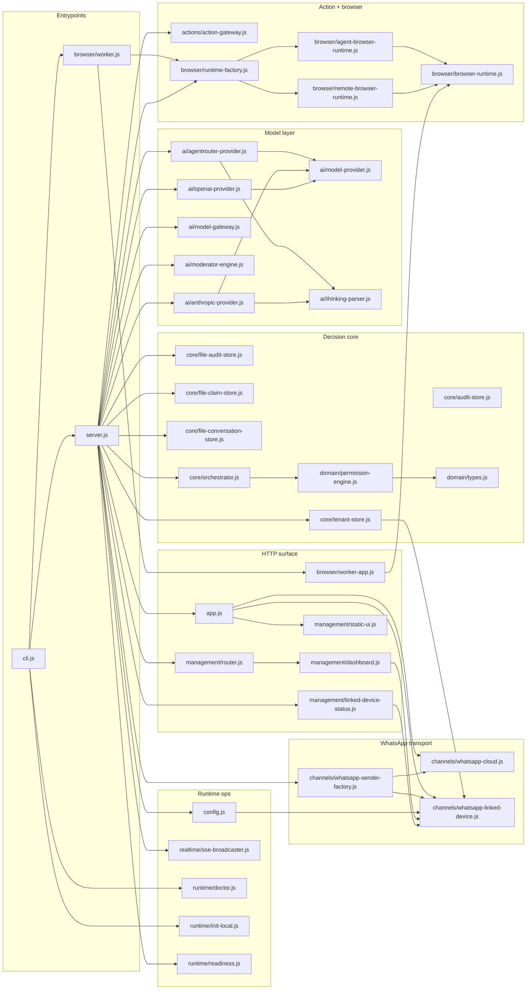
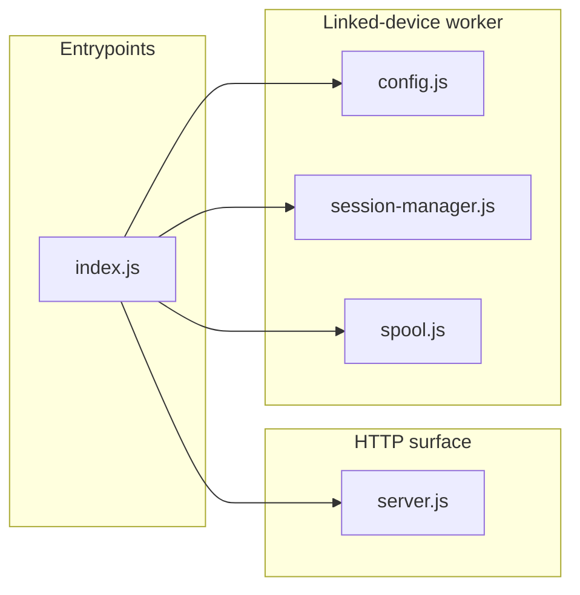

# Code Graph

Generated by `tools/code-graph.mjs`. Do not edit by hand — run `node tools/code-graph.mjs`.

Modules: 64 · first-party edges: 111 · import cycles: 0

## Supervisor process (`src/`)



## Linked-device worker process (`workers/whatsapp-web/`)



## Operator UI (`ui/src/`)

```mermaid
graph LR
  subgraph ui["Operator UI"]
    ui_src_api_client_ts["api/client.ts"]
    ui_src_api_types_ts["api/types.ts"]
    ui_src_app_App_tsx["app/App.tsx"]
    ui_src_app_format_ts["app/format.ts"]
    ui_src_app_nav_ts["app/nav.ts"]
    ui_src_components_EmptyState_tsx["components/EmptyState.tsx"]
    ui_src_components_Icon_tsx["components/Icon.tsx"]
    ui_src_components_Metric_tsx["components/Metric.tsx"]
    ui_src_components_Shell_tsx["components/Shell.tsx"]
    ui_src_components_Status_tsx["components/Status.tsx"]
    ui_src_components_TenantFormModal_tsx["components/TenantFormModal.tsx"]
    ui_src_components_WhatsAppNumbersPanel_tsx["components/WhatsAppNumbersPanel.tsx"]
    ui_src_hooks_useRealtime_ts["hooks/useRealtime.ts"]
    ui_src_main_tsx["main.tsx"]
    ui_src_pages_ActionsPage_tsx["pages/ActionsPage.tsx"]
    ui_src_pages_AuditPage_tsx["pages/AuditPage.tsx"]
    ui_src_pages_InboxPage_tsx["pages/InboxPage.tsx"]
    ui_src_pages_OverviewPage_tsx["pages/OverviewPage.tsx"]
    ui_src_pages_SettingsPage_tsx["pages/SettingsPage.tsx"]
    ui_src_pages_TenantsPage_tsx["pages/TenantsPage.tsx"]
    ui_src_pages_WhatsAppPage_tsx["pages/WhatsAppPage.tsx"]
    ui_src_vite_env_d_ts["vite-env.d.ts"]
  end
  ui_src_api_client_ts --> ui_src_api_types_ts
  ui_src_app_App_tsx --> ui_src_api_client_ts
  ui_src_app_App_tsx --> ui_src_app_nav_ts
  ui_src_app_App_tsx --> ui_src_components_Icon_tsx
  ui_src_app_App_tsx --> ui_src_components_Shell_tsx
  ui_src_app_App_tsx --> ui_src_hooks_useRealtime_ts
  ui_src_app_App_tsx --> ui_src_pages_ActionsPage_tsx
  ui_src_app_App_tsx --> ui_src_pages_AuditPage_tsx
  ui_src_app_App_tsx --> ui_src_pages_InboxPage_tsx
  ui_src_app_App_tsx --> ui_src_pages_OverviewPage_tsx
  ui_src_app_App_tsx --> ui_src_pages_SettingsPage_tsx
  ui_src_app_App_tsx --> ui_src_pages_TenantsPage_tsx
  ui_src_app_App_tsx --> ui_src_pages_WhatsAppPage_tsx
  ui_src_app_nav_ts --> ui_src_components_Icon_tsx
  ui_src_components_Shell_tsx --> ui_src_app_nav_ts
  ui_src_components_Shell_tsx --> ui_src_components_Icon_tsx
  ui_src_components_TenantFormModal_tsx --> ui_src_api_client_ts
  ui_src_components_TenantFormModal_tsx --> ui_src_api_types_ts
  ui_src_components_WhatsAppNumbersPanel_tsx --> ui_src_api_client_ts
  ui_src_components_WhatsAppNumbersPanel_tsx --> ui_src_api_types_ts
  ui_src_components_WhatsAppNumbersPanel_tsx --> ui_src_components_Icon_tsx
  ui_src_hooks_useRealtime_ts --> ui_src_api_client_ts
  ui_src_main_tsx --> ui_src_app_App_tsx
  ui_src_pages_ActionsPage_tsx --> ui_src_api_client_ts
  ui_src_pages_ActionsPage_tsx --> ui_src_api_types_ts
  ui_src_pages_ActionsPage_tsx --> ui_src_app_format_ts
  ui_src_pages_ActionsPage_tsx --> ui_src_components_EmptyState_tsx
  ui_src_pages_ActionsPage_tsx --> ui_src_components_Status_tsx
  ui_src_pages_AuditPage_tsx --> ui_src_api_client_ts
  ui_src_pages_AuditPage_tsx --> ui_src_api_types_ts
  ui_src_pages_AuditPage_tsx --> ui_src_app_format_ts
  ui_src_pages_AuditPage_tsx --> ui_src_components_EmptyState_tsx
  ui_src_pages_AuditPage_tsx --> ui_src_components_Status_tsx
  ui_src_pages_InboxPage_tsx --> ui_src_api_client_ts
  ui_src_pages_InboxPage_tsx --> ui_src_api_types_ts
  ui_src_pages_InboxPage_tsx --> ui_src_app_format_ts
  ui_src_pages_InboxPage_tsx --> ui_src_components_EmptyState_tsx
  ui_src_pages_InboxPage_tsx --> ui_src_components_Icon_tsx
  ui_src_pages_InboxPage_tsx --> ui_src_components_Status_tsx
  ui_src_pages_OverviewPage_tsx --> ui_src_api_client_ts
  ui_src_pages_OverviewPage_tsx --> ui_src_api_types_ts
  ui_src_pages_OverviewPage_tsx --> ui_src_app_format_ts
  ui_src_pages_OverviewPage_tsx --> ui_src_components_EmptyState_tsx
  ui_src_pages_OverviewPage_tsx --> ui_src_components_Metric_tsx
  ui_src_pages_OverviewPage_tsx --> ui_src_components_Status_tsx
  ui_src_pages_SettingsPage_tsx --> ui_src_api_client_ts
  ui_src_pages_SettingsPage_tsx --> ui_src_api_types_ts
  ui_src_pages_SettingsPage_tsx --> ui_src_components_Status_tsx
  ui_src_pages_TenantsPage_tsx --> ui_src_api_client_ts
  ui_src_pages_TenantsPage_tsx --> ui_src_api_types_ts
  ui_src_pages_TenantsPage_tsx --> ui_src_components_EmptyState_tsx
  ui_src_pages_TenantsPage_tsx --> ui_src_components_Icon_tsx
  ui_src_pages_TenantsPage_tsx --> ui_src_components_Status_tsx
  ui_src_pages_TenantsPage_tsx --> ui_src_components_TenantFormModal_tsx
  ui_src_pages_TenantsPage_tsx --> ui_src_components_WhatsAppNumbersPanel_tsx
  ui_src_pages_WhatsAppPage_tsx --> ui_src_api_client_ts
  ui_src_pages_WhatsAppPage_tsx --> ui_src_api_types_ts
  ui_src_pages_WhatsAppPage_tsx --> ui_src_components_EmptyState_tsx
  ui_src_pages_WhatsAppPage_tsx --> ui_src_components_Icon_tsx
  ui_src_pages_WhatsAppPage_tsx --> ui_src_components_Status_tsx
```



## Request paths

```text
Meta Cloud inbound
  POST /webhooks/whatsapp        app.js
  -> validateMetaSignature       channels/whatsapp-cloud.js
  -> normalizeWhatsAppWebhook    channels/whatsapp-cloud.js
  -> tenantStore.findByPhoneNumberId
  -> claimStore.claim            core/file-claim-store.js
  -> conversationStore.recordInbound
  -> orchestrator.handle         core/orchestrator.js
       -> modelGateway.decide    ai/model-gateway.js -> ai/*-provider.js
       -> evaluatePermission     domain/permission-engine.js
       -> channelSender.sendText channels/whatsapp-cloud.js
       -> actionGateway.execute  actions/action-gateway.js -> browser/*
  -> auditStore.append           core/file-audit-store.js
  -> sseBroadcaster.broadcast    realtime/sse-broadcaster.js

Linked-device inbound
  whatsapp-web.js 'message'      workers/.../session-manager.js
  -> spool.enqueue               workers/.../spool.js  (disk, at-least-once)
  -> POST /internal/transports/linked-device/message
  -> normalizeLinkedDeviceInbound channels/whatsapp-linked-device.js
  -> tenantStore.findByLinkedDeviceSessionId
  -> same orchestrator path as above
  -> WhatsAppLinkedDeviceSender -> POST worker /v1/send-text

Operator UI
  ui/src/api/client.ts -> /api/management/* -> management/router.js
  ui/src/hooks/useRealtime.ts -> GET /api/management/events (SSE)
```

## Authority model

```text
model decision (intent, confidence, requestedAction)   advisory only
        |
        v
policy.minConfidence  ->  below threshold => human
policy.rules[intent]  ->  no match       => policy.defaultAction
rule.action           ->  authority ceiling
requestedAction       ->  may only lower authority (draft < reply < act)
        |
        v
tenant.shadowMode     ->  suppresses side effects, records wouldAction
```

## Hub modules

- `ui/src/api/client.ts` — imported by 11 module(s)
- `ui/src/api/types.ts` — imported by 10 module(s)
- `ui/src/components/Icon.tsx` — imported by 7 module(s)
- `ui/src/components/Status.tsx` — imported by 7 module(s)
- `src/channels/whatsapp-linked-device.js` — imported by 6 module(s)
- `ui/src/components/EmptyState.tsx` — imported by 6 module(s)
- `ui/src/app/format.ts` — imported by 4 module(s)
- `src/ai/model-provider.js` — imported by 3 module(s)

## Unreferenced by first-party code (entrypoints or dead code)

- `src/cli.js`
- `ui/src/main.tsx`
- `workers/whatsapp-web/src/index.js`

## External dependencies

- `react` (15 import sites)
- `node:path` (13 import sites)
- `node:crypto` (11 import sites)
- `node:fs` (10 import sites)
- `node:fs/promises` (6 import sites)
- `node:http` (3 import sites)
- `node:child_process` (2 import sites)
- `node:util` (2 import sites)
- `node:module` (1 import site)
- `qrcode.react` (1 import site)
- `react-dom` (1 import site)

## Import cycles

None.

## Module inventory

| module | group | lines | imports | imported by | exports | tests |
| --- | --- | --- | --- | --- | --- | --- |
| `src/actions/action-gateway.js` | action | 25 | 0 | 1 | `ActionGateway` | `action-gateway.test.js` |
| `src/ai/agentrouter-provider.js` | ai | 112 | 2 | 1 | `AgentRouterProvider` | `agentrouter-provider.test.js` |
| `src/ai/anthropic-provider.js` | ai | 162 | 2 | 1 | `AnthropicProvider` | `anthropic-provider.test.js` |
| `src/ai/model-gateway.js` | ai | 61 | 0 | 1 | `ModelGateway` | `model-gateway.test.js` |
| `src/ai/model-provider.js` | ai | 13 | 0 | 3 | `ModelProvider` | — |
| `src/ai/moderator-engine.js` | ai | 223 | 0 | 1 | `AutonomousModeratorEngine` | `moderator-engine.test.js` |
| `src/ai/openai-provider.js` | ai | 89 | 1 | 1 | `OpenAIProvider` | `openai-provider.test.js` |
| `src/ai/thinking-parser.js` | ai | 63 | 0 | 2 | `extractThinkingAndCleanText`, `parseDecisionJson`, `validateDecision` | `thinking-parser.test.js` |
| `src/app.js` | http | 232 | 3 | 1 | `createHttpServer` | `app.test.js` |
| `src/browser/agent-browser-runtime.js` | action | 87 | 1 | 1 | `AgentBrowserRuntime` | `browser-runtime.test.js` |
| `src/browser/browser-runtime.js` | action | 35 | 0 | 3 | `validateBrowserTask`, `BrowserRuntime` | — |
| `src/browser/remote-browser-runtime.js` | action | 61 | 1 | 1 | `RemoteBrowserRuntime` | `browser-runtime.test.js` |
| `src/browser/runtime-factory.js` | action | 19 | 2 | 2 | `createBrowserRuntime` | `browser-runtime.test.js` |
| `src/browser/worker-app.js` | http | 96 | 1 | 1 | `createBrowserWorkerServer` | `browser-worker.test.js` |
| `src/browser/worker.js` | entry | 29 | 2 | 1 | — | — |
| `src/channels/whatsapp-cloud.js` | channel | 87 | 0 | 2 | `normalizeWhatsAppWebhook`, `validateMetaSignature`, `verifyWebhookChallenge`, `WhatsAppCloudSender` | `whatsapp-cloud.test.js`, `whatsapp-sender-factory.test.js` |
| `src/channels/whatsapp-linked-device.js` | channel | 84 | 0 | 6 | `whatsappTransportMode`, `normalizeLinkedDeviceInbound`, `WhatsAppLinkedDeviceSender` | `linked-device-channel.test.js`, `whatsapp-sender-factory.test.js` |
| `src/channels/whatsapp-sender-factory.js` | channel | 26 | 2 | 1 | `createWhatsAppSender` | `whatsapp-sender-factory.test.js` |
| `src/cli.js` | entry | 79 | 4 | 0 | `main` | — |
| `src/config.js` | runtime | 122 | 1 | 1 | `loadConfig`, `resolveTenantSecret` | `config-browser.test.js` |
| `src/core/audit-store.js` | decision | 16 | 0 | 0 | `InMemoryAuditStore` | `app.test.js`, `orchestrator-audit-reason.test.js`, `orchestrator.test.js` |
| `src/core/file-audit-store.js` | decision | 49 | 0 | 1 | `FileAuditStore` | `file-stores.test.js` |
| `src/core/file-claim-store.js` | decision | 41 | 0 | 1 | `FileClaimStore` | `file-stores.test.js` |
| `src/core/file-conversation-store.js` | decision | 181 | 0 | 1 | `FileConversationStore` | `file-conversation-store.test.js` |
| `src/core/orchestrator.js` | decision | 118 | 1 | 1 | `SupervisorOrchestrator` | `orchestrator-audit-reason.test.js`, `orchestrator.test.js` |
| `src/core/tenant-store.js` | decision | 172 | 1 | 1 | `InMemoryTenantStore` | `tenant-store-crud.test.js`, `tenant-store-linked-device.test.js` |
| `src/domain/permission-engine.js` | decision | 57 | 1 | 1 | `evaluatePermission` | `permission-engine.test.js` |
| `src/domain/types.js` | decision | 9 | 0 | 1 | `AUTONOMY_ACTIONS`, `assertAutonomyAction` | — |
| `src/management/dashboard.js` | http | 90 | 1 | 1 | `sanitizeTenant`, `recentAuditEvents`, `buildOverview`, `buildActions` | `management-dashboard.test.js` |
| `src/management/linked-device-status.js` | http | 111 | 1 | 1 | `createLinkedDeviceStatusProvider` | — |
| `src/management/router.js` | http | 262 | 1 | 1 | `createManagementRouter` | `management-router.test.js` |
| `src/management/static-ui.js` | http | 59 | 0 | 1 | `serveStaticUi` | `static-ui.test.js` |
| `src/realtime/sse-broadcaster.js` | runtime | 76 | 0 | 1 | `SseBroadcaster` | `sse-broadcaster.test.js` |
| `src/runtime/doctor.js` | runtime | 160 | 0 | 1 | `runDoctor` | `runtime-cli.test.js` |
| `src/runtime/init-local.js` | runtime | 42 | 0 | 1 | `initializeLocalWorkspace` | `runtime-cli.test.js` |
| `src/runtime/readiness.js` | runtime | 64 | 0 | 1 | `probeDataDirectory`, `collectReadiness` | `readiness.test.js` |
| `src/server.js` | entry | 163 | 19 | 1 | — | — |
| `ui/src/api/client.ts` | ui | 89 | 1 | 11 | `managementToken`, `setManagementToken`, `api` | — |
| `ui/src/api/types.ts` | ui | 146 | 0 | 10 | `TransportMode`, `ConversationControl`, `WhatsAppNumber`, `Tenant`, `TenantCreatePayload`, `TenantUpdatePayload`, `WhatsAppSession`, `AuditEvent`, `ConversationMessage`, `Conversation`, `Overview`, `ActionEvent`, `RuntimeInfo` | — |
| `ui/src/app/App.tsx` | ui | 88 | 12 | 1 | `App` | — |
| `ui/src/app/format.ts` | ui | 18 | 0 | 4 | `formatTime`, `formatDateTime`, `percent` | — |
| `ui/src/app/nav.ts` | ui | 20 | 1 | 2 | `RouteKey`, `navItems`, `routeFromHash` | — |
| `ui/src/components/EmptyState.tsx` | ui | 4 | 0 | 6 | `EmptyState` | — |
| `ui/src/components/Icon.tsx` | ui | 39 | 0 | 7 | `Icon` | — |
| `ui/src/components/Metric.tsx` | ui | 10 | 0 | 1 | `Metric` | — |
| `ui/src/components/Shell.tsx` | ui | 107 | 2 | 1 | `Shell` | — |
| `ui/src/components/Status.tsx` | ui | 9 | 0 | 7 | `Status` | — |
| `ui/src/components/TenantFormModal.tsx` | ui | 169 | 2 | 1 | `TenantFormModal` | — |
| `ui/src/components/WhatsAppNumbersPanel.tsx` | ui | 199 | 3 | 1 | `WhatsAppNumbersPanel` | — |
| `ui/src/hooks/useRealtime.ts` | ui | 108 | 1 | 1 | `RealtimeEvent`, `connectRealtime`, `useRealtime` | — |
| `ui/src/main.tsx` | ui | 15 | 1 | 0 | — | — |
| `ui/src/pages/ActionsPage.tsx` | ui | 19 | 5 | 1 | `ActionsPage` | — |
| `ui/src/pages/AuditPage.tsx` | ui | 22 | 5 | 1 | `AuditPage` | — |
| `ui/src/pages/InboxPage.tsx` | ui | 151 | 6 | 1 | `InboxPage` | — |
| `ui/src/pages/OverviewPage.tsx` | ui | 89 | 6 | 1 | `OverviewPage` | — |
| `ui/src/pages/SettingsPage.tsx` | ui | 22 | 3 | 1 | `SettingsPage` | — |
| `ui/src/pages/TenantsPage.tsx` | ui | 180 | 7 | 1 | `TenantsPage` | — |
| `ui/src/pages/WhatsAppPage.tsx` | ui | 33 | 5 | 1 | `WhatsAppPage` | — |
| `ui/src/vite-env.d.ts` | ui | 2 | 0 | 0 | — | — |
| `workers/whatsapp-web/src/config.js` | worker | 58 | 0 | 1 | `loadWorkerConfig` | `whatsapp-web-worker-config.test.js` |
| `workers/whatsapp-web/src/index.js` | entry | 70 | 4 | 0 | — | — |
| `workers/whatsapp-web/src/server.js` | http | 89 | 0 | 1 | `createWhatsAppWebWorkerServer` | `whatsapp-web-worker-server.test.js` |
| `workers/whatsapp-web/src/session-manager.js` | worker | 294 | 0 | 1 | `WhatsAppWebSessionManager` | `whatsapp-web-session-manager.test.js` |
| `workers/whatsapp-web/src/spool.js` | worker | 91 | 0 | 1 | `DiskInboundSpool` | `linked-device-spool.test.js` |
